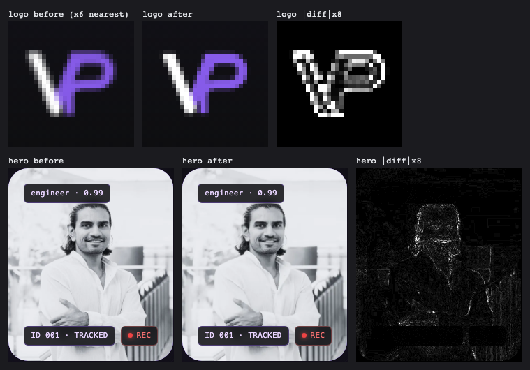
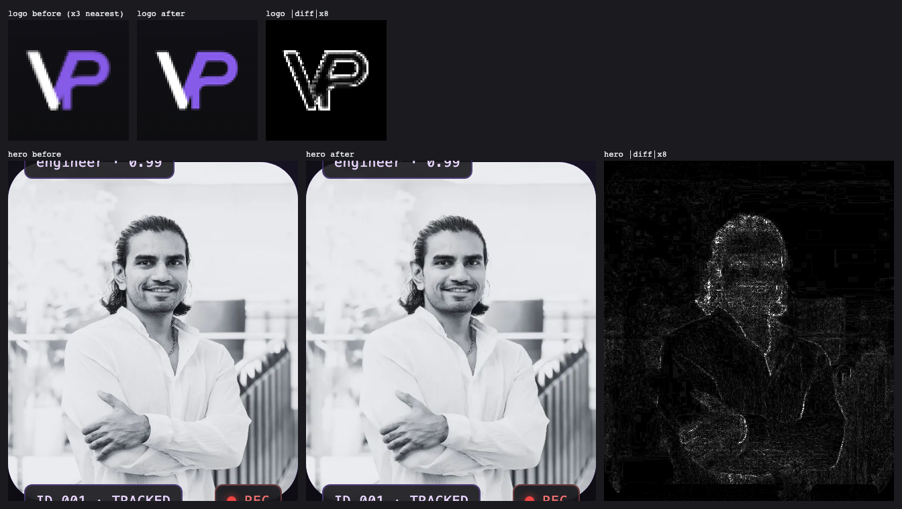

# Issue #252 portrait and header logo sizing

[Issue #252](https://github.com/vivekpatel99/my-portfolio-webisite/issues/252) was reproduced against develop `a792461` on 2026-09-30 (audit lane findings P-2 and P-3).

## Change

- The hero portrait and the About photo use `srcset` candidates 480w and 720w, with the 1008w original as the top candidate. The derivatives are `cwebp -q 80 -m 6 -sharp_yuv` downscales of the committed original, with the same crop. The hero uses `sizes="(min-width: 768px) 236px, 216px"`, which matches its CSS frame (300/256 px max width minus 32/20 px padding). About uses its own panel formula and stays `loading="lazy"`. Both images carry `width="1008" height="1367"`. Their CSS `w-full h-full` box is unchanged.
- The 30 px header logo in the bar and in the drawer uses `mylogo-60.webp` for 1x/2x and `mylogo-90.webp` for 3x. Both are lossless WebP files made from `sips` downscales of `mylogo.png`. `mylogo.png` still serves the dark-scheme favicon.
- The original portrait still serves JSON-LD, and the About photo uses it at large DPR-2 widths.
- No `fetchpriority` and no preload were added. Measurement did not support either (see below).

## Measurements

The runs used the lane harness: cold cache, external hosts blocked, CPU 4×, Slow 4G, and seeded consent. Mobile was 412×823 at DPR 1.75, and desktop was 1350×940 at DPR 1. [Raw runs, conditions and visual statistics](assets/2026-09-30/issue-252-performance.json).

| Route (profile) | LCP before (ms) | LCP after (ms) | FCP before → after (ms) | LCP element after |
| --- | ---: | ---: | --- | --- |
| Home (mobile) | 2740–2748 | 1700–1716 | 1332–1336 → 1336–1344 | portrait 480w |
| Home (desktop) | 2928–2940 | 1796–1800 | 1356–1360 → 1356 | portrait 480w |
| /contact/ (mobile) | 1736–1752 | 1424 | 1236–1252 → 1252 | logo 60 |
| /legal/ (mobile) | 1648–1652 | 1416–1420 | 1240 → 1240–1244 | logo 60 |
| /data-policy/ (mobile) | 1640–1660 | 1428–1440 | 1236–1252 → 1248 | logo 60 |

Transfer sizes:

- The portrait went from 71.7 KB to 15.5 KB (480w) at mobile DPR 1.75 and desktop DPR 1.
- The logo went from 50.3 KB to 1.5 KB.
- Home image bytes after a full scroll went from 790.9 to 714.7 KB on mobile and from 790.9 to 685.9 KB on desktop. The lazy About photo now fetches its own candidate: 720w on mobile and 480w on desktop.

Rejected experiments on top of the derivatives:

- `fetchpriority="high"` on the hero image: mobile LCP was 1676–1700 ms and desktop LCP was 1764–1816 ms. That is no better than without it, so it was not added.
- A home-only `<link rel="preload" as="image" imagesrcset>` with `fetchpriority="high"`: LCP dropped to 1420–1440 ms, but FCP rose by 76–88 ms (to 1420–1440 ms). That breaks the ≤ 1.40 s FCP criterion. The preload would also reach every route that `.htaccess` rewrites to `index.html`.

## Visual comparison

Element screenshots were taken at rendered size with reduced motion, before and after, at 1440×900 DPR 1/2, 412×823 DPR 1.75 and 390×844 DPR 2/3. Each composite shows before, after and the absolute difference ×8. The logo is enlarged with nearest-neighbour scaling so its device pixels stay visible.

- Hero portrait: PSNR was 37.8–41.5 dB, and 0.26–0.70% of pixels differed by more than 16/255. The differences are resampling texture only; the crop, tone and badges are unchanged.
- Logo: PSNR was 26.9–33.7 dB. The differences are limited to 1 px anti-aliased edges; the shape and colours are unchanged.
- About photo: PSNR was 31.9–40.2 dB where a derivative is selected. It is identical at 1440 px DPR 2 and 390 px DPR 3, because those select the original.

## Limits

These are lab numbers, not field data. The runs used Chromium only; Firefox, real Safari/iOS and the deployed host were not measured. Each variant ran 2–3 times.
