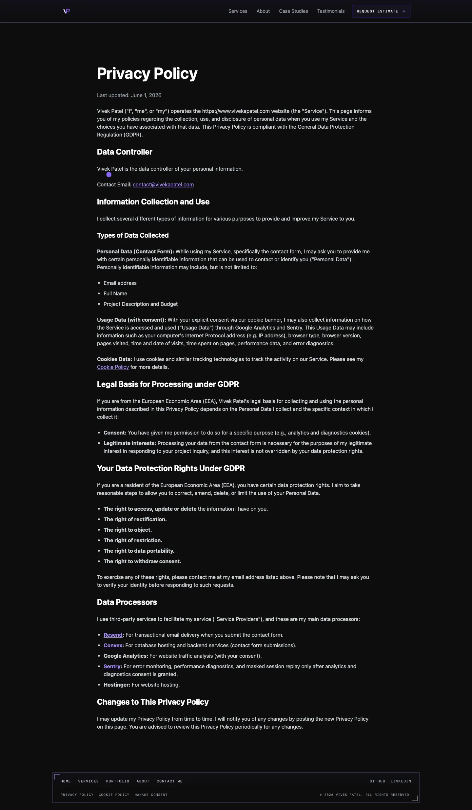
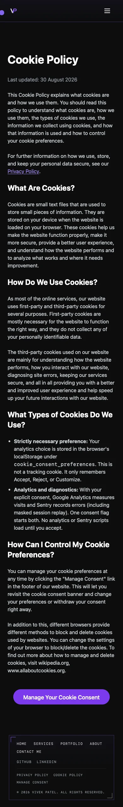

# Issue 255 policy link verification

Six inline policy links now have underlines at rest. The implementation replaces `hover:underline` with `underline underline-offset-2` in Legal and DataPolicy. The approved `#A78BFA` colour remains.

## Selection and reproduction

Checked the ordered queue in #267, issue comments, open and merged PRs, local branches and occupied checkouts. Earlier items had merged implementations or active work. #255 had no claim, overlapping PR or implementation. Claimed #255 before editing.

Base and tested develop were `a1f7948507796befd185ac7983d2b52ce78ab0a0`. Used the current clean checkout on `codex/255-policy-link-underlines`. No new worktree.

Codex reproduced the resting computed styles in T3 on the local production preview. All five Legal links and the DataPolicy link had `text-decoration-line: none`, with colour `rgb(167, 139, 250)`. T3 axe reproduced Legal's `link-in-text-block` violation. The matched automated baseline reproduced that rule on both routes in all 16 cells. Baseline `color-contrast` had zero violations.

## Acceptance results

The local production preview used port 3015. The matched matrix used installed Playwright Chromium and WebKit, widths 390 and 1440, heights 844 and 900 respectively, both policy routes, and both `no-preference` and `reduce` motion settings. Analytics consent was rejected in storage and outbound non-loopback requests were blocked. Axe 4.10.2 checked `main` with only `link-in-text-block` and `color-contrast` enabled.

| Check | Before | After |
| --- | --- | --- |
| Matrix cells | 16 | 16 |
| Cells with `link-in-text-block` violations | 16 | 0 |
| Cells with `color-contrast` violations | 0 | 0 |
| Axe incomplete results | 0 | 0 |
| Resting inline underline | None on six links | All six, 2 px offset |
| Link colour | `#A78BFA` | `#A78BFA` |

Compared matched link line boxes, wrapping, destinations, target/rel attributes, document widths and main heights. Maximum link-box difference was 0 CSS px. No horizontal overflow or page exceptions occurred.

All inline links were reached by keyboard with visible focus outlines and persistent underlines. Chromium used Tab. WebKit used Option+Tab to include links under its default macOS keyboard preference. Underlines persisted during hover. Enter on the internal policy link reached the opposite policy route and rendered its expected heading in every cell. External links and email were inspected without opening them.

Codex independently inspected the actual six-line implementation diff and T3 rendered desktop Legal and mobile DataPolicy pages. T3 also showed the mobile Legal page and Enter navigation from DataPolicy to Legal. Inspected WebKit screenshots of both routes. The screenshots below use normal motion with consent already rejected. T3 additionally showed the consent-visible state.

[Baseline measurements](assets/issue-255/before.json) and [final measurements](assets/issue-255/after.json) include each cell's axe result, styles, geometry and keyboard evidence.

## Checks and review

- `npm ci --no-audit --no-fund` passed.
- `npm test` passed 63 files and 729 tests.
- `npm run build` passed, including display-image validation and 21 static routes. Existing large-chunk warnings remain.
- Scoped ESLint parsing and explicit correctness rules passed. The repository has no root ESLint configuration; this was not a full repository lint run.
- `git diff --check` passed. Impeccable's detector returned no findings on the changed pages.
- Separate implementation agent changed only the two pages. Fresh `/code-review` agents followed `.claude/commands/code_review.md` independently for requirements and code quality. Both final verdicts were PASS with no scoped defects. The requirements reviewer initially withheld acceptance until final browser evidence existed, then inspected the complete matrix.
- `/no-comments` found zero introduced comments or flags. Codex's `/deslop` inspection found no extra logic or abstractions.

Two verification harness issues were corrected without changing application code. Route URL readiness preceded the destination heading, so navigation verification now waits for that heading. WebKit's default Tab preference excludes links, so its link traversal uses native Option+Tab. Both final runs passed.

## Limits and delivery conditions

Firefox, physical Safari/iOS and screen-reader speech were not verified. This is local production-build evidence, not deployment evidence. All issue acceptance criteria have supporting local evidence. Keep #255 open until the PR's required checks and merge conditions are met. No merge or deployment is authorized by this task.
