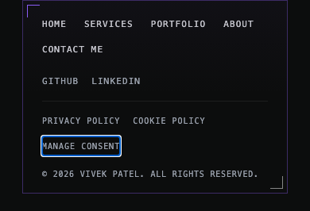
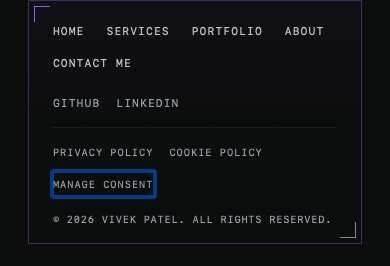

# Issue #256 footer target verification

Verified on 1 October 2026 against `develop` commit
`db399db4726132371c85f7600bbf221d1cf89023` and the scoped footer change.
This is local production-build evidence. No merge or deployment was performed.

## Selection and reproduction

The #267 queue, issue comments, open PRs and local worktree branches were checked
before selecting #256. Earlier queue items had merged implementations or
outstanding acceptance. #257 was claimed in another thread. #256 had no claim,
PR or matching task branch. The claim was posted on #256 before implementation.

Independent Codex reproduction in the T3 browser at 390×844 on `/contact/`
found Privacy Policy and Manage Consent at 98.289×15 px. Their row centers
were 23 px apart. axe-core 4.10.3 reported two `target-size` failing nodes,
with a safe clickable diameter of 22 px. The upper controls were 16.5 px tall.
The baseline had 720 passing unit tests and a passing production build.

The browser regression check failed on the baseline build:

```text
/: Home
Expected: >= 24
Received: 16.5
1 failed
```

## Change and acceptance evidence

A separate implementation agent added `inline-flex min-h-6 items-center` to
all nine footer anchors and the consent button. These classes give every
control a 24 px minimum height and center its text. The existing text sizes,
colors, widths, wrapping, borders, routes and consent event remain intact.
The footer becomes taller on mobile to accommodate the enlarged targets.

The parent independently inspected the source diff and rendered T3 behavior
at 320, 390 and 1440 px. All controls measured 24 px tall. No horizontal
overflow was found. Desktop navigation and social links share their original
row, and the policy controls share their original lower row. T3 confirmed a
visible keyboard focus ring and that Manage Consent opens the consent panel.

The repeatable browser matrix covers Chromium and WebKit at 320×844,
390×844 and 1440×900, with both normal and reduced motion. It checks all
20 configured public routes and an unknown route, exceeding the original
13-route audit coverage.

| Acceptance | Result |
| --- | --- |
| axe `target-size` at 320 and 390 on all audited routes | Zero violations and zero incomplete audits across the full matrix |
| Every footer control at least 24 px tall | Minimum measured height 24 px across 2,520 control checks |
| No overflow at 320; desktop rows preserved at 1440 | Passed on every route in both engines and motion modes |
| Manage Consent opens the panel | Passed by keyboard in all 12 browser projects and by pointer in T3 |

The matrix also checks visible focus and keyboard order through all ten
controls, plus Enter navigation to both policy pages. WebKit uses Option-Tab
to include links under the host's default keyboard setting, as described in
[Apple's keyboard guidance](https://support.apple.com/en-gb/guide/safari/cpsh003/mac).
The initial plain-Tab WebKit failures were resolved by this test correction.
No application focus logic changed.

[Machine-readable matrix summary](assets/issue-256/footer-results.json)

| Chromium, 390 px | WebKit, 390 px |
| --- | --- |
|  |  |


## Checks and rerun

- `npm test`: 63 files, 720 tests passed.
- `npm run build`: passed, including display-image checks, sitemap and static route generation.
- Footer unit tests: 6 passed.
- Footer browser matrix: 24 tests passed, including 252 route checks.
- Standalone QA command with its own temporary build/server: 2 tests passed.
- Scoped ESLint with unused-variable, undefined-name and JSX usage rules: passed.
- `git diff --check`: passed.

The build retains its existing warning about chunks larger than 500 kB.
The local preview has no Convex URL and logs the expected configuration warning.
No contact submission was attempted.

To rerun the footer matrix from the repository root, download the pinned axe
source outside the checkout and let the config build and serve a temporary
production bundle. The config writes its artifacts outside the repository.

```sh
task_dir=$(mktemp -d /tmp/horizons-footer-qa-XXXXXX)
curl -fsSL https://cdnjs.cloudflare.com/ajax/libs/axe-core/4.10.3/axe.min.js -o "$task_dir/axe.min.js"
QA_FOOTER_AXE_PATH="$task_dir/axe.min.js" QA_FOOTER_OUTPUT_DIR="$task_dir" npx playwright test -c tests/qa/qa-footer-targets.config.js
```

For an already-running local production preview, add
`QA_FOOTER_BASE_URL=http://127.0.0.1:4276`. The test config rejects remote hosts.
The matrix summary records the axe source SHA-256. Disposable rerun artifacts
can be removed after inspection.

## Limits

Physical touch devices, Firefox, real Safari and assistive-technology speech
were not tested. WebKit automation is not proof of real Safari behavior.
The axe check is scoped to the footer's target-size rule, not a full-site
accessibility audit. #256 remains open until its merge conditions are met.
