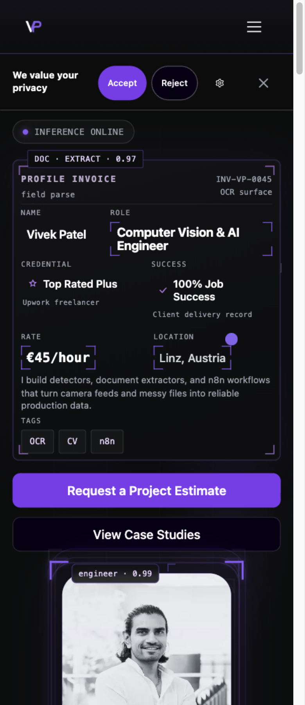
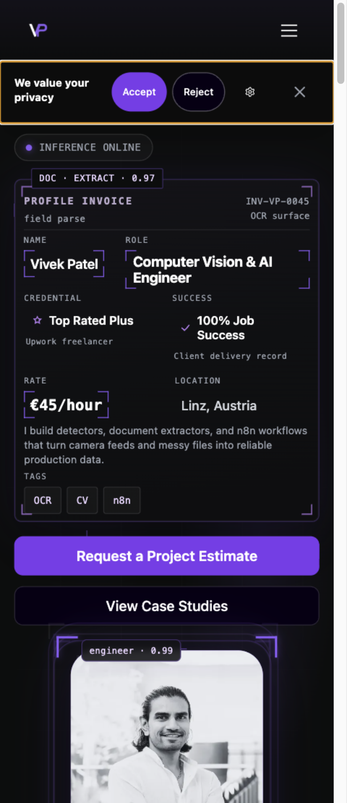
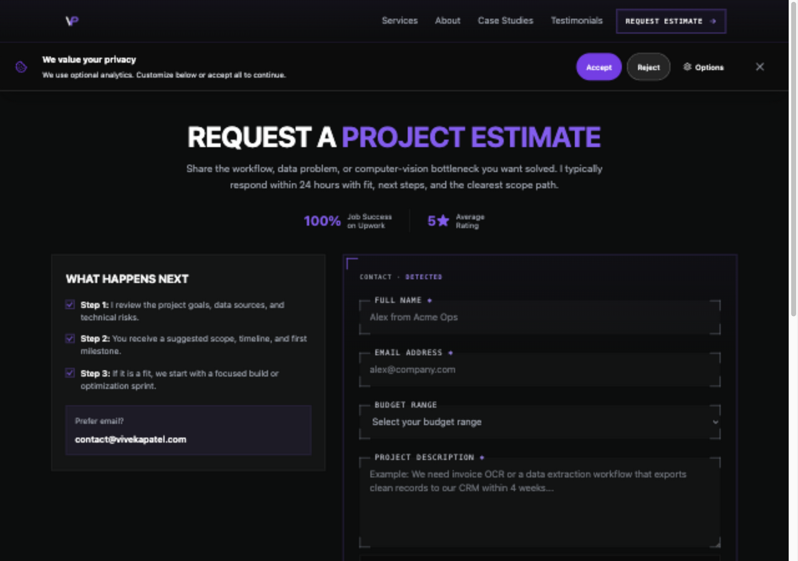

# Issue 258 consent layout verification

The banner now meets the header and preserves reading position in Chromium and WebKit. The owner requested retaining the 1.5-second first-visit delay. First-visit CLS remains a known limitation, so this PR references #258 and keeps it open.

## Scope and selection

Starting checkout was clean on `t3code/fix-issue-267`, HEAD `2895fe79bc933ef4bf5caf236fa2bc60fd688672`. Current remote `develop` had the same SHA. Work uses this checkout and `codex/258-consent-layout`; no worktree was created.

The #267 queue, issue comments, open and merged PRs, and occupied local branches were checked before claiming #258. Earlier queue items were merged implementations, delivered work with outstanding evidence, or active #259 work in PR #281. No #258 implementation or claim was found. The claim and latest timing preference are recorded on #258.

The user first approved immediate display, then explicitly requested the original 1.5-second delay. The final artifact retains 1500 ms. No immediate-display change is delivered.

## Reproduction and root cause

Against the starting production build, header bottom was 69 px and banner top was 72 px. All four issue routes reproduced the 3 px gap in both engines.

The baseline first-arrival probe moved a paragraph by 13 px at 390 px and 21 px at 1280 px in WebKit on home and contact. Chromium moved it by 0 px. Manager/settings probes also reproduced WebKit movement. Baseline raw data is linked below.

WebKit changes scroll position when `--consent-banner-bottom` changes scroll padding. Reading `scrollY` after that write captured an already-shifted value. Layout now captures scroll position and spacer geometry before changing padding. It updates the spacer synchronously and corrects the original scroll position in the same pass. Temporary native anchoring suppression avoids competing Chromium compensation and restores its prior inline value.

A regression test reproduced an 18 px padding side effect before the correction. Instrumented WebKit also confirmed that opening and expanding settings preserve the correct original scroll target. Settings changes no longer temporarily report a zero reservation. Focus entry and restoration use `preventScroll`, and pending focus work is cancelled on close.

A shared CSS variable defines the 69 px header height. The header still contains a 68 px inner bar and its existing 1 px border. Colors, copy, typography, control sizes, and the existing opacity/vertical entrance remain.

## Rendered acceptance

| Check | Result |
| --- | --- |
| Header/banner adjacency | Exactly 69 px in 64 route/width/motion/engine cells: four routes, 320/390/768/1280, normal/reduced motion, Chromium/WebKit |
| Main content at top | Main starts at or below the banner bottom; no horizontal overflow in all 64 cells |
| Reading position | 0 px drift through open, Options, collapse, Reject, reopen, and Accept on home/contact at 390/1280 in both motion preferences and engines |
| Delayed arrival | 0 px drift on home/contact at 390/1280 in both engines, reduced motion; strengthened test asserts the banner is still hidden before the baseline sample |
| Existing consent regressions | 32 tests pass, including no spacer after Reject/reload, expanded settings, focus restoration, skip-link clearance, and no telemetry after rejection |
| Storage failures | Existing consent/telemetry unit tests pass as part of the full suite |

Codex independently inspected the diff and the rendered T3 preview. At 390 px, header/banner top was 69 px and main top 138 px. Expanded settings ended at 351 px with main at 352 px. At 1280 px, header/banner top was 69 px and main top 146 px. After the existing route entrance settled, a contact paragraph moved 0 px on manager open and Reject. Keyboard Enter opened Options; Tab reached Analytics and Save Preferences; Enter saved rejection and removed the spacer. Browser tests verify visible control centers and focus restoration in both engines.

The first consent frame is absent until the retained delay. The first-arrival test measures an actual hidden-to-visible transition, not stability after an immediate banner. Normal and reduced motion are covered by the geometry, manager, settings, and existing consent tests. Real assistive-technology speech output is unverified.

## Matched CLS measurements

| Route / viewport | Before unseeded median | After unseeded median | Before seeded median | After seeded median |
| --- | ---: | ---: | ---: | ---: |
| / 412 | 0.087633 | 0.084253 | 0.005400 | 0.005400 |
| / 1350 | 0.057694 | 0.055635 | 0.002098 | 0.002098 |
| /case-studies/ 412 | 0.080150 | 0.076811 | 0.000000 | 0.000000 |
| /case-studies/ 1350 | 0.054909 | 0.052850 | 0.000000 | 0.000000 |
| /contact/ 412 | 0.080150 | 0.076811 | 0.000000 | 0.000000 |
| /contact/ 1350 | 0.054909 | 0.052850 | 0.000000 | 0.000000 |

All six Chromium measurement cases passed their seeded checks; six WebKit CLS cases are explicitly skipped because LayoutShift/CDP measurement is Chromium-only. First-visit values remain above 0.01 with the retained delay.

The probe uses the same production-preview port, cold cache, fresh context, 4x CPU throttling, 150 ms latency, 200,000 bytes/s download, and 93,750 bytes/s upload before and after. Viewports are 412x823 and 1350x940. Each seeded/unseeded condition has three runs. External requests are blocked. The recorded value sums non-input layout-shift entries during the load and a 5.5-second observation period; it is a conservative lab total, not field CLS.

Keeping the delay means new visitors can see the banner spacer inserted after page paint. The <=0.01 first-visit goal is not claimed as complete. The issue's timing-dependent criterion is not activated by the final owner preference, but the broader CLS goal remains unresolved. `Refs #258` preserves that distinction.

## Checks and limitations

737 unit tests in 63 files pass. Production build passes with generated image checks, sitemap, 36 public-link checks, and 21 static route outputs. Scoped ESLint and `git diff --check` pass. This checkout has no ESLint config, so scoped lint used `eslint:recommended`, React JSX usage rules, and no-unused-vars with parser/environment settings for the changed files.

The Impeccable detector found only existing gradient text in `src/index.css`, outside the changed height variable. It was retained to preserve the approved visual identity. The existing build chunk-size warning and missing local Convex configuration warning remain. No contact request was submitted.

Fresh review is recorded in [the code review](2026-10-01-issue-258-code-review.md). [Raw browser measurements](assets/issue-258/measurements.json) contain baseline and final geometry, anchors, arrival, and CLS data.

Physical Safari/iOS, Firefox, screen-reader speech, deployed hosting, and field performance remain unverified. No merge or deployment was performed. #258 stays open for the retained-delay CLS limitation and merge conditions.

## Repeat the checks

Run a production build and preview on an exclusive loopback port. Output directories must be outside the repository.

```sh
npm test
npm run build
npm run preview -- --port 4318 --strictPort
QA_LOCAL_ONLY=1 QA_CONSENT_OUTPUT_DIR=/absolute/external/output npx playwright test -c tests/qa/qa-consent-layout.config.js
QA_LOCAL_ONLY=1 QA_CONSENT_EXISTING=1 QA_CONSENT_OUTPUT_DIR=/absolute/external/regression-output npx playwright test -c tests/qa/qa-consent-layout.config.js
```

`QA_CONSENT_BASE_URL` selects another loopback preview. `QA_CONSENT_PROBE=1` collects measurements without applying defect assertions for baseline comparison. Seeded home CLS is asserted; unseeded CLS is recorded as the retained-delay limitation.

## Screenshots

The banner has the same approved visual treatment. Final mobile capture shows the explicitly opened manager focus outline. These captures do not establish pixel identity because hero detections animate and randomize independently.






