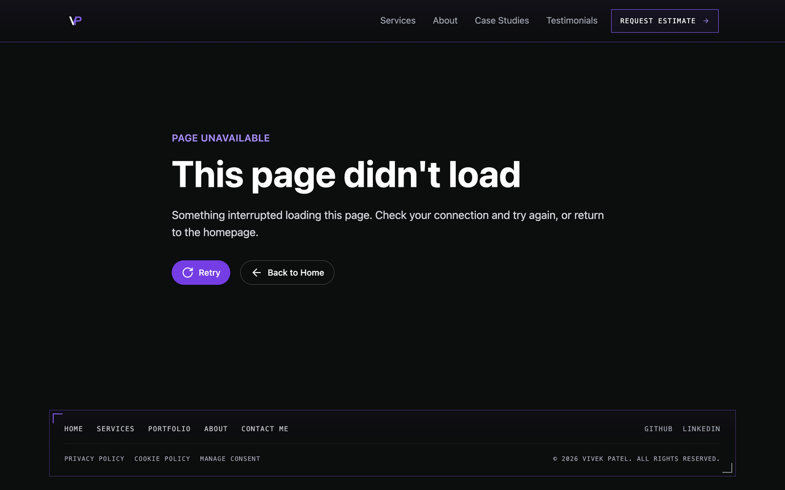
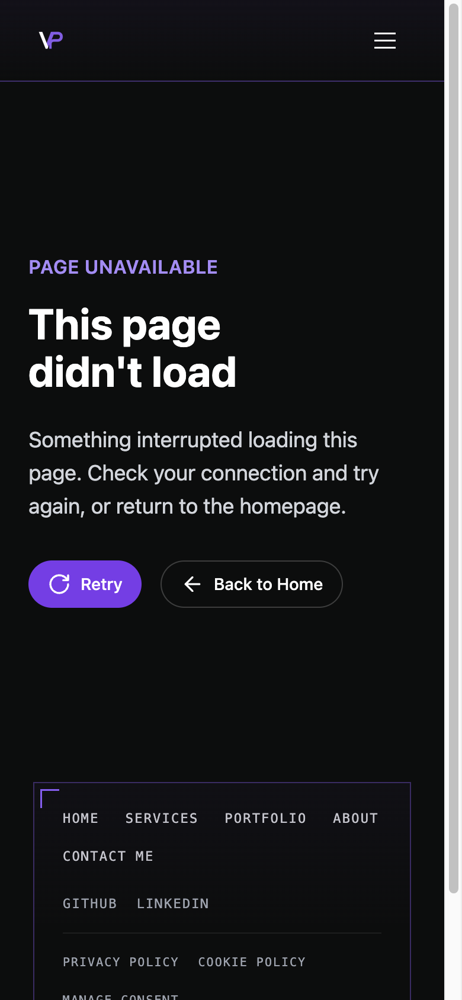

# Route error metadata verification

Issue [#262](https://github.com/vivekpatel99/my-portfolio-webisite/issues/262) was selected from [#267](https://github.com/vivekpatel99/my-portfolio-webisite/issues/267) after checking current develop, issue comments, open and merged PRs, and occupied local task branches. Earlier items had implementations or acceptance gates. #258 was claimed by another thread, and #259 had open PR #281. No #262 implementation or claim existed. This thread claimed #262 before editing.

The starting develop commit was `2895fe79bc933ef4bf5caf236fa2bc60fd688672`. The current checkout was clean. No worktree was created. A separate implementation subagent owned the fallback and its component tests. Codex owned independent browser verification and delivery.

## Reproduction and root cause

On the starting production build, Codex injected a 503 response for `ContactRoute-*.js` through a local-only preview server, then activated the footer Contact Me link in T3. At `/contact/`, the focused recovery heading read `This page didn't load`, but the title remained `Vivek Patel - Expert AI & Computer Vision Engineer` and robots metadata was absent. The shared fallback mounted no `Seo` component.

The component regression failed before the source change in both lazy-import and render-error cases. Expected `Page unavailable | Vivek Patel`; received `Healthy route | Vivek Patel`. The focused suite had 2 failures and 8 passes. After the fix, all 10 cases passed.

The fallback now mounts the existing `Seo` component with an error-specific title, description, failed pathname and `noindex`. Recovery copy, Retry, Back to Home, focus handling and styles are unchanged. The canonical URL describes the failed pathname. No new application state or metadata mechanism was added.

## Acceptance evidence

| Criterion | Result |
| --- | --- |
| Exact fallback title | `Page unavailable | Vivek Patel` in all 8 browser cells and both component failure cases |
| Fallback robots | Exactly one robots meta, `noindex, nofollow`, in all 8 cells |
| Metadata restored after navigation | Keyboard Back to Home restores the original home title and `index, follow`; subsequent Privacy Policy navigation restores its title and `index, follow` in all 8 cells |
| Existing boundary tests | All 8 existing cases and 2 new cases pass |

The original matched production-build matrix covers Chromium and Playwright WebKit at 390×844 and 1280×800, with normal and reduced motion. All 8 starting-build checks failed on the stale title; all 8 final checks passed. Geometry matched in every cell and the fallback crops were pixel-identical at the original PR head. After `develop` advanced, the repeated matrix passed in all 8 cells with no horizontal overflow and identical measured geometry. Screenshot text wrapping changed with merged PR #284, which adds `text-wrap: balance` to all `h1`, `h2` and `h3` elements. The fallback title now balances onto different lines at mobile width. This style change is already part of `develop`; the metadata fix adds no visible content or layout. [The comparison data](assets/issue-262/comparison.json) records the original and updated-base results.

Each final browser test activates Contact Me by keyboard, checks recovery-heading focus, traverses Retry and Back to Home, activates Back to Home and verifies main-content focus. On macOS WebKit, Option-Tab includes links in traversal; plain Tab skipped the native Back to Home anchor in the first run. The corrected full keyboard traversal passes in all WebKit cells. No application change was made for that platform behavior.

Codex independently inspected the source diff and drove the updated production build in T3 at desktop and mobile widths. T3 confirmed the heading wraps onto two balanced lines on mobile, measured its 80 px box, and read the exact error title and `noindex, nofollow`. Tab reached Retry with `:focus-visible` and a solid outline. Tab then reached Back to Home; Enter restored `/`, the home title, `index, follow` and main-content focus.





## Checks and rerun

- The original baseline passed 729 tests in 63 files; the original implementation passed 731. After #281 and #284 merged into `develop`, the automated review correctly flagged that the updated tree had not been tested. On commit `05ad2f475e310dc543dc7d3aeaeae849e7dfcfb2`, `npm test` passed 735 tests in 63 files. This rerun resolves that finding.
- `npm run build` and the route metadata matrix passed on `5b01a0099e4171f90f298681092945017ec8d61a`. Commit `05ad2f475e310dc543dc7d3aeaeae849e7dfcfb2` changes only QA documentation and evidence relative to that app tree, so the build and browser results apply to the delivered application code. The matrix passed all 8 cells. The build generated the sitemap and 21 static routes; the existing chunk-size warning remains.
- Scoped ESLint passed with explicit React JSX, unused-variable and undefined-name rules. The repository has no project ESLint configuration or typecheck script.
- `git diff --check` passed. A fresh comment review found no added comments or suppressions to remove.
- Fresh isolated requirements and code-quality reviews are recorded in [the review report](2026-10-01-issue-262-code-review.md).

To rerun the committed browser regression, build and serve the production output on a loopback port, then run:

```sh
npm ci
npm test
npm run build
npm run preview -- --port 3062 --strictPort
```

In another terminal, run the browser suite. Its output directory must be outside the repository.

```sh
QA_LOCAL_ONLY=1 QA_PREVIEW_URL=http://127.0.0.1:3062 \
QA_METADATA_OUTPUT_DIR=/absolute/external/task-directory \
npx playwright test -c tests/qa/qa-route-metadata.config.js
```

The suite aborts the contact chunk itself, guards external network access, seeds rejected optional consent and sends no contact submission. It attaches geometry JSON and fallback crops to its JSON result.

## Limits and delivery conditions

Search-engine treatment, deployed host behavior, Firefox, physical Safari/iOS and assistive-technology speech are unverified. Playwright WebKit is not a physical Safari test. Retry behavior is unchanged; #263 remains separate. This task changes runtime fallback metadata and does not establish an HTTP error status or server-side crawler behavior.

The issue remains open until required checks pass and the pull request merges. Production deployment remains a separate release step.
