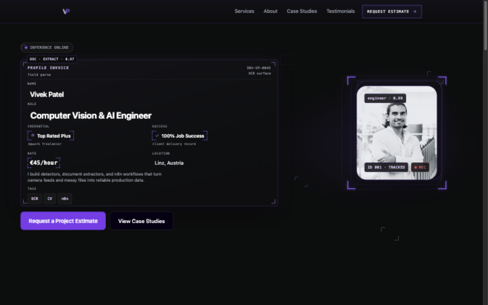
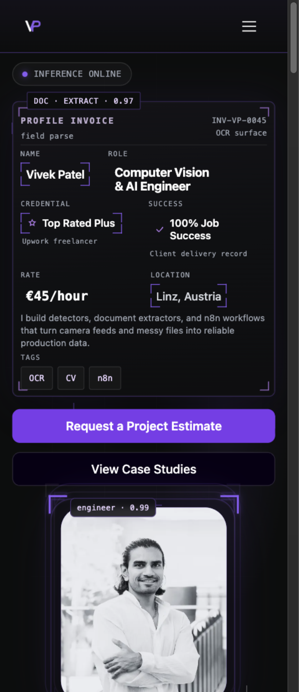

# Issue #264: entry bundle verification

Issue: https://github.com/vivekpatel99/my-portfolio-webisite/issues/264

Baseline: current develop `e17a0a817f2a492acac1b76b5f16260f531fb3b7`.
Implementation: `76459a2`, with whitespace cleanup `01e719c`.

## Scope and reproduction

The ordered #267 queue, live issue comments, open PRs, develop history and local
branches were checked before claiming #264. Earlier open children already had
merged implementations or remaining platform/owner verification gates. No #264
claim or PR existed; this thread posted its claim before implementation.

The production build reproduced both causes: all six scoped consumers imported
full `motion`; browser image helpers included build-only source, thumbnail and
newer display-image integrity hashes. The lightweight strict-provider regression
failed on the full components, and the bundled helper regression found standalone
digests before implementation. A separate agent implemented the change.

All six consumers now use `m`; Layout wraps routed and shared content in
`LazyMotion features={domAnimation} strict`. Animation props and CSS are unchanged.
Complete image integrity metadata lives in `publication/case-study-derivatives.js`,
used by the delivery plugin and derivative generator. Browser helpers retain only
URL bindings. The build registry is deeply equal to its baseline; all 384 checked
source/poster/helper combinations preserve their outputs. Article sections remain
synchronous. No approved image bytes, public content or design tokens changed.

The browser/build URL maps must be updated together. An exhaustive parity test
checks every reviewed binding; this is the one optional P3 observation from the
Standards review, with no blocking findings.

## Matched bundle measurements

Both measurements use Node 22.22.1, the exact package-lock dependencies, Vite
6.4.3, the existing Terser configuration and the same environment. The baseline
was built from a temporary archive of the pinned commit, sharing the locked
node_modules; the final build used the current checkout. No worktree was created.
Sizes are actual bytes; gzip uses Node `gzipSync` with identical default options.
Preliminary measurements taken before restoring locked dependencies are excluded.

| Measurement | Develop | Implementation | Saving |
| --- | ---: | ---: | ---: |
| Minified entry | 502,252 | 451,922 | 50,330 (10.0%) |
| Gzip entry | 154,624 | 140,228 | 14,396 (9.3%) |
| Standalone 64-hex digests | present | 0 | all removed |

Baseline entry: `index-CgFG2KQ8.js`; final: `index-CFpe8O-z.js`.
The entry is below the decimal 452,000-byte limit and gzip saving exceeds 10,000
bytes. Hashes inside content-addressed asset filenames remain public URLs.
These are bundle measurements, not claims about LCP, TBT or field performance.

## Verification

- `npm run build`: passed, including deterministic checks of 23 regenerated
  display derivatives for 29 published sources, sitemap and 21 static HTML files.
- `npm test -- --maxWorkers=1`: all 750 tests in 65 files passed with existing
  deadlines (423.57 seconds). The initial concurrent runs hit existing 5/60/180
  second deadlines. Serial validation resolved every failure without relaxing
  assertions or changing application behavior.
- Real strict-provider component tests cover cursor movement without React
  commits, consent behavior, contact lifecycle, routed `m` animation, and section
  viewport entrances. Publication tests still reject stale/tampered sources,
  thumbnails and display derivatives; self-contained build fixtures pass.
- Scoped ESLint with the installed React App config: no errors; the unchanged
  Data Policy anchor retains its existing `jsx-a11y/anchor-is-valid` warning.
- `git diff --check` passes.

- The entry route sweep passes all 21 routes in eight combinations:
  Chromium/WebKit, 1440×900/390×900, normal/reduced motion. No browser
  console/page errors, horizontal overflow or broken loaded images were found.
- Matched baseline/final rectangle comparison: **zero CSS-pixel delta** in every
  combination; all captured image URLs are identical. Captures cover header,
  main/H1, footer, gallery stage/inline image and contact form. See
  [geometry summary](assets/issue-264/geometry-comparison.json) and
  [bundle measurements](assets/issue-264/measurements.json).
- Eight final keyboard-state tests pass, covering consent options/rejection,
  contact empty validation and gallery open/Escape/focus restoration. One first
  WebKit run hit the existing route-handler teardown race after closing a gallery
  while its original image was loading. The new test now waits for that image to
  finish before closing; all eight state checks then passed (33.9 seconds).

- `npm run qa:motion`: **64/64 passed** across all four projects (5.5 minutes),
  with a fresh build and managed preview. This covers normal/reduced entrances,
  contact validation/pending/failure/success, and changes of motion preference
  after load. An earlier replay stopped after 41 passes because the old manual
  preview exited (SIGTERM 143); remaining failures were connection refused.
  The successful fresh run changes no tests or application behavior.
- The fresh mock-backend build also measures 451,922 minified bytes, with no
  non-filename digests (gzip 140,230; the two-byte variation is the backend URL).

- Existing visual/cursor/hero suite: **85 passed, 18 applicability skips,
  5 WebKit failures** (4.6 minutes). The same five failures reproduce on the
  pinned develop build in a focused eight-case replay (2 passed, 1 skip, 5 failed):
  three desktop hero RAF/IntersectionObserver settling checks and both
  short-wide gallery outer-aspect checks. The gallery discrepancy is exactly
  the existing two vertical border pixels; hero values show incomplete
  frame-based easing and one cleanup write batch. Hero, gallery markup/CSS and
  original media dimensions are unchanged by this PR. These are baseline
  failures on this unsupported host, not established regressions in #264.
  No assertion deadlines or unrelated product behavior were changed to bypass
  them. All Chromium visual cases pass, as do other WebKit visual cases.
- The pinned develop's official CI run
  [36977455730](https://github.com/vivekpatel99/my-portfolio-webisite/actions/runs/36977455730)
  passed on the supported Playwright Noble image. The PR's required CI must
  establish the remaining visual acceptance gate in that environment before
  this issue can be marked complete.

## Fresh review

The separate implementation agent did not review its own work. Fresh Standards
and Spec agents reviewed the diff against pinned develop and #264. Standards:
PASS, no documented violations or blocking defects, one optional P3 URL-map
synchronization observation. Spec: implementation matches scope; local visual
acceptance remains partial for the five reproduced baseline host failures above.
[Full review reports](assets/issue-264/reviews.md) preserve the two axes separately.
Codex independently inspected the source and rendered behavior.

## Independent rendered inspection

Codex independently inspected the complete diff and the rendered pages in T3
at 390 and 1280/1440 CSS pixels, using a local preview reached through the
machine's Tailscale address. The home invoice/portrait, CTA gap and typography
retain the approved identity. Contact empty validation focuses `name`, shows all
three errors and stays contained. Mobile menu Escape restores the toggle's focus
and releases main-content inertness. The gallery uses the display derivative
inline and the original only when enlarged; Escape restores its opener.

Representative T3 screenshots with rejected optional consent:




## Rerun

```sh
npm ci
npm run build
npm test -- --maxWorkers=1
npm run preview -- --port 4264 --strictPort
# In another shell; entry results go outside the repository:
QA_ENTRY_BASE_URL=http://127.0.0.1:4264 \
  QA_ENTRY_OUTPUT_DIR=/tmp/issue-264-entry-qa \
  npx playwright test -c tests/qa/qa-entry-bundle.config.js
npm run qa:motion
QA_PREVIEW_URL=http://127.0.0.1:4264 QA_PROD_URL=http://127.0.0.1:4264 \
  QA_LOCAL_ONLY=1 QA_ARTIFACT_SAFE_MODE=1 \
  npx playwright test -c tests/qa/qa.config.js \
    --project=preview-desktop --project=preview-mobile \
    --project=preview-webkit-desktop --project=preview-webkit-mobile \
    qa-visual.spec.js qa-cursor.spec.js qa-hero-motion.spec.js
```

For a matched geometry comparison, run the entry suite against a baseline build
and the final build into separate output directories. Match the eight
`*-geometry.json` files by engine, viewport and motion preference; compare route,
source URLs and element rectangles. Test capture ignores offscreen lazy images
and waits for fonts and the retained page entrance to settle. It checks 20 known
routes plus an unknown-route fallback, with console/page-error collection.

This Ubuntu 26.04 host is newer than locked Playwright's support matrix. The
Ubuntu 24.04 browser builds were used with dependencies extracted into the task's
temporary directory and software EGL; no system packages were installed. All
baseline/final browser conditions use the same setup. Chromium/WebKit lab checks
do not establish real Safari/iOS, Firefox, screen-reader speech, deployed hosting,
live contact delivery or field performance. Contact state tests use the existing
in-memory mock transport; no live contact request was sent.

## Delivery and cleanup

The primary checkout is retained as requested. Pre-existing skill/plugin edits
and untracked files are preserved against the original task-delivery snapshot.
The issue stays open pending required CI and merge conditions. No merge or
deployment is authorized or performed. Task-owned processes and disposable
artifacts are removed after the pushed SHA and PR head are verified.
