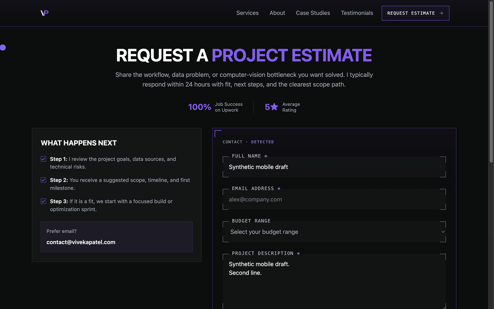
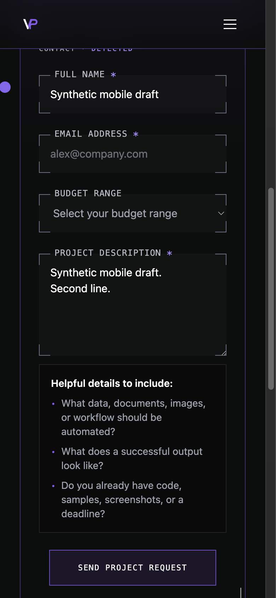

# Issue #265: unsent contact drafts

## Decision, selection and reproduction

The owner selected option A in the implementation thread and
[recorded it on #265](https://github.com/vivekpatel99/my-portfolio-webisite/issues/265#issuecomment-5948484504):
retain draft fields in tab memory, restore them after in-app navigation/Back,
warn on reload/close where supported, and clear after confirmed submission.
No draft personal data may be written to localStorage or sessionStorage.

The ordered #267 queue, issue comments, open/merged PRs, occupied local branches
and current develop were checked before claiming #265. Earlier implementations
and active work were excluded. #264 was owned by PR #286; #263 requires real
Safari/iOS evidence before implementation. No duplicate #265 work was found.

On starting develop `e17a0a817f2a492acac1b76b5f16260f531fb3b7`, Codex reproduced
the problem in T3: enter a synthetic name and multiline description, activate
Services, then Back. Both fields returned empty; a cancelable beforeunload event
was not prevented. Two regression assertions also failed before the fix.

During verification, #264 merged. The existing checkout was synchronized with
develop `a0622e6795d8fd03fe19199a7452aa1ce163724b`; the contact-test import conflict
was resolved preserving its strict LazyMotion coverage and the draft tests.
No new worktree was created and no unrelated work was discarded.

## Implementation

`useContactDraft` owns four strings and the pending submission snapshot in the
browser document. React subscribes with `useSyncExternalStore`. Drafts survive
Contact unmounts; a single unload listener remains while any field is nonempty,
including on another route. Clearing every field or successful submission removes
the warning. Reload/tab close discards memory; another document starts empty.

One shared pending snapshot blocks duplicate sends after route remount. Failures
retain fields; successful completion clears the submitted snapshot, including
after unmount. An obsolete completion cannot erase a newer draft. Validation,
mutation payload, local outcome feedback, receipt, form copy, CSS and markup stay
unchanged. Receipt feedback remains local to the submitting instance; navigating
away and remounting during a send does not persist that receipt.

## Verification

Final integrated validation results are recorded below.
[Case-by-case validation](assets/issue-265/validation.json) retains the sanitized
browser results and unit/build counts (Node22.22.1/npm9.2.0).

- Targeted Contact/draft tests: 63 passed, including StrictMode listener ownership,
  restoration, clearing, failure, off-route warning, pending remount, stale
  completion and storage spies.
- Full integrated unit suite: 760 passed / 4 timed out (764 total). Three
  publication fixture builds exceeded their subprocess timeout; one testimonial
  test exceeded 5 seconds. The unchanged testimonial suite passed 23/23 in
  isolation. A serial, eight-CPU isolated publication rerun passed 16/18; two
  nested npm builds still timed out. The full suite is **not green**.
- Production build: pass on integrated develop; 21 static routes generated.
- Contact lifecycle matrix: 88 passed / 0 failed / 0 skipped, across Chromium
  and WebKit, 1280×800 / 390×800 and normal/reduced motion. The integrated
  combined run passed all 44 Chromium checks, then failed WebKit’s first Back
  main-focus assertion before draft values were measured. The unchanged scoped
  WebKit rerun passed all 44 checks; actual reload dismiss/accept dialogs were
  observed in all eight projects. Earlier harness/loading/focus failures remain
  exploratory failures; they are not counted as passing checks.
- Scoped React ESLint, JavaScript syntax and diff checks: pass; the existing
  create-react-app preset emits a dependency maintenance notice.
- Impeccable detector on Contact: no findings.

The original full baseline had 744 passes and one editor-dev-server timeout;
that unchanged editor suite passed its isolated rerun. Before synchronization,
the full changed suite had 758 passes and one publication-fixture timeout; its
isolated rerun reached a nested Vitest process timeout. These runs were on a
shared host with other publication checks running. Neither failure was hidden
by changing assertions or production behavior. The final integrated timing failures above remain unresolved; no publication
files or test timeouts were changed in this scoped contact-draft task.

The lifecycle suite uses an in-memory Convex transport and blocks external
requests. It verifies native keyboard navigation and Back, all four fields,
unchanged storage, empty new documents, unload handling, reload dialog
dismiss/accept, pending success/failure, single submission, invalid-field focus,
safe error feedback, disabled/loading states and the lasting focused receipt.
No live contact request was sent.

## Independent rendered inspection

Codex inspected the source diff and T3 rendering independently of the implementer.
Desktop and mobile keyboard Services/Back restored synthetic drafts. Dirty unload
protection continued off-route and stopped after clearing the last field.
Browser storage remained unchanged. Ten rectangles at each of 1280×800 and
390×844 matched the starting baseline exactly, with consent rejected, loaded
fonts and normal motion. There was no horizontal overflow.
[Measured rectangles](assets/issue-265/t3-geometry.json) record the observed values.

After synchronization, a fresh T3 document rendered four empty fields, no
unload protection and no overflow. The initial fresh load needed a task-owned
Vite restart after dependency optimization became outdated during the develop
update. T3 then disconnected before an updated screenshot could be captured;
the inspected images and baseline comparisons below precede that update.
The form markup/styles remain unchanged relative to integrated develop.

The T3 tab reports `document.hasFocus() === false`, so its keyboard focus target
alone does not establish a visible focus indicator. The project browser suite
checks the restored field's actual focus frame and violet corner/gradient styles.




## Fresh review

The implementer did not review its own work. Fresh isolated `/code-review`
reviewers inspected `a0622e6...04dda64` before committing.

- Standards: clean; no material correctness, maintainability or architecture
  findings.
- Spec: clean implementation verdict against #265 and the recorded option A.
  The reviewer explicitly did not certify pending browser execution or a green
  full unit suite.

The source and QA blobs in the delivered commit match that reviewed snapshot;
this report is finalized with the actual validation outcomes.

## Rerun and limits

```sh
npm ci
taskset -c 0,1 npm test -- --maxWorkers=2
npm run build
QA_CONTACT_LIFECYCLE_ARTIFACT_DIR=/tmp/issue-265-contact-qa npm run qa:contact-lifecycle
```

Final unit validation caps the runner's CPU affinity to two CPUs so nested fixture
runners also avoid excessive parallelism; no assertions or timeouts are changed.
On this Ubuntu 26.04 host, locked Playwright uses supported Ubuntu 24.04 browser
builds with task-local extracted libraries and software EGL. No system packages
or shared browser cache were modified. The normal supported CI/browser setup
does not need these host adaptations.

Reload/close warnings depend on browser support and prior interaction. Physical
Safari/iOS, Firefox, screen-reader speech, tab termination by the operating system
and live delivery are not verified. In-memory drafts do not survive a confirmed
reload/close. This is the approved privacy tradeoff.

## Delivery

The issue remains open until acceptance, required checks and reviewed integration
merge conditions are met. No merge or deployment is included. Task-owned servers,
dependencies, build output and disposable artifacts are removed after remote SHA
and PR verification. The existing shared T3 checkout is retained as requested.
