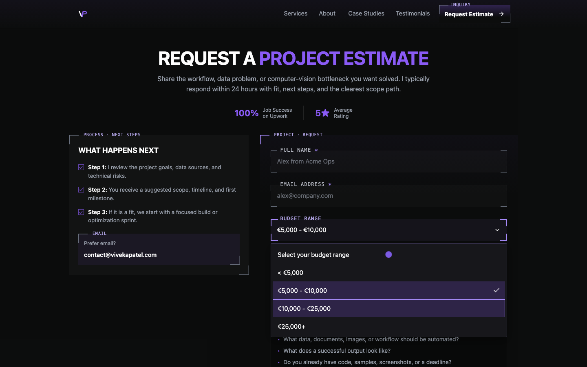
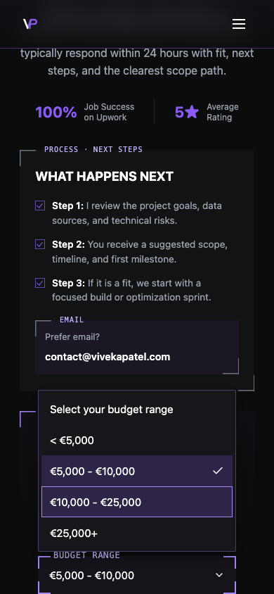
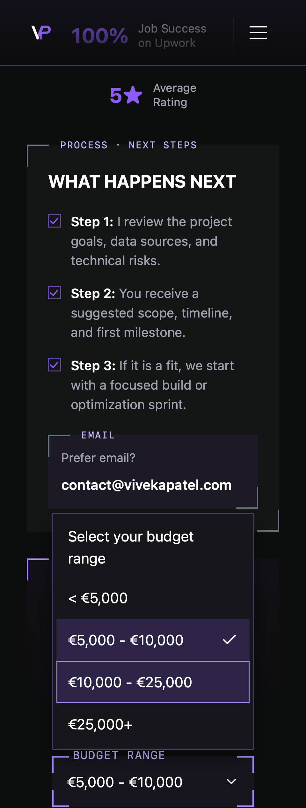
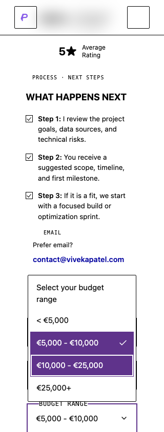

# Themed Budget Range dropdown verification

The approved 8 October 2026 FM-01 change replaces the native menu with a controlled Headless UI Listbox. The menu uses a subtle purple highlight, white text, and a checkmark for the selected option. Keyboard focus adds an outline independently of selection. Grey resting and purple focused/open field corners remain intact.

The exact string catalog and optional empty choice remain in `src/lib/budgetOptions.js`. Unknown controlled drafts retain their disabled recovery choice and validation error until a blank or listed value is chosen. Form validation, tab-memory drafts, transport, payload normalization, duplicate-submit protections, pending states, receipt, and retry behavior remain covered by the existing contact suites.

## Implementation and dependency choice

No accessible select component existed in the repository. The installed Radix components cover other controls. Headless UI 2.2.10 supports the actual empty string and form progression directly. The dropdown adds no custom navigation state; the library manages the option focus and keyboard interaction.

Library defaults need narrow boundary adaptations. Closed-trigger Enter opens through the primitive's ArrowDown handler rather than submitting the form or relying on a click that the primitive ignores after mouse interaction. A disabled stale option cannot emit an unknown value and clear its error. Both have regression coverage using the real primitive, including a valid synthetic lead and exact hidden FormData.

Model the Domain keeps the existing budget catalog and controlled draft string as the source of truth. Prove It Works uses rendered browser interaction, exact committed values, and submission counters rather than compilation alone.

## Environment and results

Baseline: `develop` at `0c74308161c3af65377e4ec96693a4f56205cf06`. The production build and static-route generation used a task directory outside the repository and preview port 4278. The parent preview on port 3000 and its `dist` were preserved. Contact lifecycle QA used port 4279 and isolated synthetic transport. HTTP/WebSocket egress was blocked during passive QA. No real lead was submitted.

| Check | Result |
| --- | --- |
| Full unit suite | 916 passed across 71 files, including 75 Contact tests. |
| Production build | Vite build, 23 display derivatives, sitemap, 21 static routes, and 36 public links passed. |
| Dropdown matrix | 30 passed, six forced-colors skips for unsupported WebKit emulation. |
| Existing contact colors and geometry | Eight passed. |
| Full contact lifecycle on final source | 204 passed, four existing headless WebKit middle-click skips. |
| Existing label/contrast and contact guidance QA | Four passed. |
| Independent source review | Two keyboard edges fixed; no remaining concrete findings. |

Dropdown coverage uses Chromium 148.0.7778.96 and WebKit 26.4 at 320 × 844, 390 × 844, and 1440 × 900, each with normal and reduced motion. Lifecycle coverage uses desktop 1280 × 800 and mobile 390 × 800 in both engines and motion settings. [Source hashes, environment records, final counts, and limitations](assets/themed-budget/verification.json) identify the tested source without publishing raw browser reports or baseline data.

## Interaction coverage

- Enter on a closed trigger opens without submitting, including when every required field is valid. Space and ArrowDown also open.
- Arrow navigation changes the active option without committing. Enter commits the exact value and returns focus. Home, End, and typeahead operate on the list.
- Escape dismisses without changing the committed value and restores trigger focus. Tab and Shift+Tab dismiss and reach the description and email controls respectively.
- Every listed value and the empty choice can be selected. The chosen option exposes `aria-selected` and a visible checkmark. Focus has a separate outline.
- The trigger and menu include Budget Range and the current value in their accessible names. Expansion, active descendant, selection, disabled state, and validation description are exposed through the primitive.
- Touchscreen taps select at 320px and 390px. The portal avoids form-panel clipping and stays inside the viewport, including a 300px-high scrolling viewport. Mobile WebKit uses a programmatic page-scroll probe for anchor tracking because its emulated mouse wheel is unsupported.
- Forced colors retain the field's 1px resting and 2px focused system outlines, the menu boundary, selected checkmark, and separate focused option outline. Reduced motion removes the existing field transition; the menu adds no animation.
- Pending submission disables both the trigger and hidden form value. Synthetic lifecycle checks preserve exact payloads, drafts through navigation, safe error guidance, retry focus, duplicate prevention, and receipt behavior.

The prior-source Enter regression failed with one native submit event and no open menu. External transport was blocked. The final-source regression passes across all 12 dropdown projects with zero native submit events. Native input in the Codex in-app browser also opened with Enter, committed the visible `< €5,000` label with ArrowDown and Return, and advanced to Project Description with Tab. Its native accessibility tree exposed the named list and selected option.

Spoken VoiceOver/NVDA output, physical Safari/iOS devices, native browser zoom, and physical touchscreen scroll gestures were not exercised. WebKit forced-colors emulation and headless middle-click do not establish those platform behaviors.

## CI follow-up on 9 October

The initial hosted run failed one WebKit typeahead check and one mobile WebKit lifecycle selection. Both scenarios passed repeated local checks on the original source: ten keyboard repetitions and 40 lifecycle repetitions. The lifecycle failure remains unreproduced locally.

The primitive derives option text from a detached clone after removing the decorative checkmark. Explicit option names now match the visible labels, so typeahead does not depend on the clone's rendered text. A focused unit regression fails on the prior source by retaining `€25k+` after typing `<`, and passes on the repaired source by committing `< €5k` without submission. No appearance, string catalog, or transport changes are involved.

The repaired source passed 917 unit tests, the 30-check dropdown matrix with six expected skips, the full 204-check synthetic lifecycle with four expected skips, production build/static-route checks, and artifact sanitization verification. Follow-up source hashes and browser counts are recorded separately in the verification file; the screenshots and initial environment records above remain from the original verification.

Independent scrolling QA then exposed a viewport fault. Instrumented repetitions reproduced it in three of 30 desktop WebKit runs: the active option's `scrollIntoView` moved the document to satisfy its 128px header scroll padding. In one trace, the trigger moved to y=358.74 in a 300px viewport and the menu extended to y=352.5. Removing document scroll padding only while this menu is mounted passed 30 instrumented repetitions with the original geometry predicate.

Fully offscreen triggers now dismiss the menu through the primitive's Escape handler, leaving the value unchanged and removing focus from the offscreen field. Enter after mouse interaction uses its ArrowDown handler; an added regression fails on the prior click-based source. The first menu render also seeds the primitive's public width variable from the trigger: mobile WebKit had exposed a temporary 10px menu before its resize measurement, changing option wrapping and scroll behavior.

Linux WebKit still failed the original raw `<` key press after the label change. QA now sends Shift+Comma and checks the delivered character is `<` before asserting the focused option. Touch QA uses the fixture's touch setting; emulated WebKit reports zero `navigator.maxTouchPoints`. Geometry assertions retain their original viewport limits, add a settled Home-navigation check, and verify dismissal after a large scroll with no value change or scroll-back to the field.

Final local follow-up verification passed 917 unit tests, 30 dropdown checks with six expected skips, and all 50 affected mobile WebKit lifecycle checks with two expected middle-click skips. Build and static-route generation passed. The earlier full lifecycle run remains recorded separately; hosted CI and the independent review must verify the final published PR head.

## Screenshots

The desktop image shows a checkmark on the selected row and a separate outline on the next focused row.









## Repeat the checks

Point the standalone dropdown suite at an isolated loopback production preview:

```sh
QA_BUDGET_BASE_URL=http://127.0.0.1:4278 npx playwright test -c tests/qa/qa-budget.config.js
```

Its default output directory is temporary and outside the repository. Set `QA_BUDGET_OUTPUT_DIR` to retain a report and `QA_BUDGET_SCREENSHOT_DIR` to capture synthetic screenshots. The spec also runs in local passive CI projects for Chromium and WebKit, with no raw captures in safe artifact mode.

Run the existing field-state suite with `QA_COLOR_SCHEME_BASE_URL` and an external `QA_COLOR_SCHEME_OUTPUT_DIR`, filtering for `contact controls`. Run the synthetic lifecycle suite with `QA_CONTACT_LIFECYCLE_PORT` and an external `QA_CONTACT_LIFECYCLE_ARTIFACT_DIR`.

The [7 October native-budget report](2026-10-07-issue-330-native-budget.md) is historical evidence for the superseded control. This report covers local verification of the new dropdown. Production deployment is outside this change.
