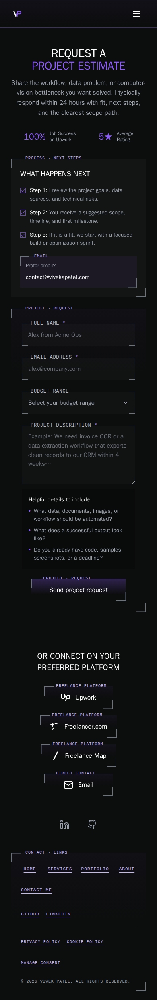
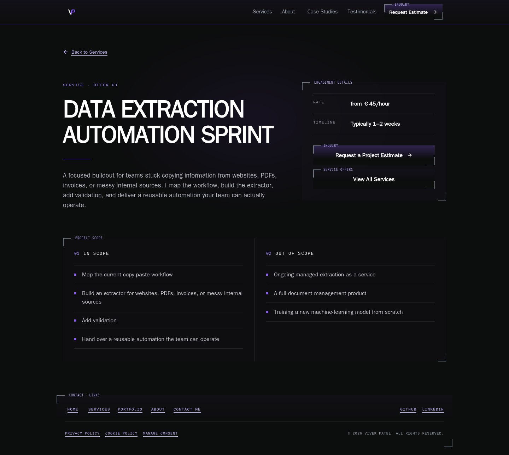
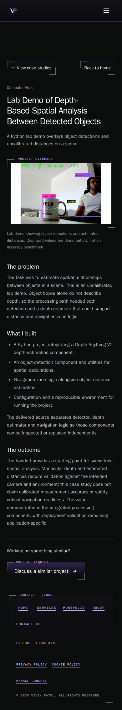

# Preproduction candidate verification — 9 October 2026

## Verdict

**NOT READY for production approval.** The frozen application candidate is
`88e0530d07342141744b087a667caf113071dee2` on fetched `develop`. Its required
[CI run](https://github.com/vivekpatel99/my-portfolio-webisite/actions/runs/37897382165)
passed, but supplemental local suites did not all pass. Platform, delivery and
complete theme acceptance also remain open. Green CI is evidence for its defined
matrix, not a substitute for those checks.

This delivers verification evidence for [#331](https://github.com/vivekpatel99/my-portfolio-webisite/issues/331).
Use `Refs #331`: full acceptance is not established. All prerequisite code PRs
are merged, but #321, #322 and #324 retain explicit verification gaps. Keep
[#186](https://github.com/vivekpatel99/my-portfolio-webisite/issues/186) open:
read-only production HEAD requests still returned HTTP 404 for all three valid
service URLs. Production promotion, deployment, real contact submissions,
email delivery and vendor telemetry were not performed.

## Candidate and environment

The clean checkout started on `t3/implement-issue-331` at the SHA above. Fetching
and fast-forwarding from `origin/develop` reported already up to date. No new
worktree was created. Application source and its browser target remain exactly
that candidate throughout verification; this PR adds evidence and the separately
requested skill update. A later application commit requires impact checks again.

The local production build used Node 24.5.0 and the explicit synthetic endpoint
`https://qa-contact-lifecycle.convex.cloud`, with Sentry and GA identifiers empty.
Preview was `http://127.0.0.1:4311`. Playwright ran in the cached
`mcr.microsoft.com/playwright:v1.60.0-noble` container, Node 24.15.0, Chromium
148.0.7778.96 and WebKit 26.4. Local browser fixtures blocked non-loopback HTTP
and WebSockets. Viewports were 1440×900, 980×1324, 390×844 and 320×740.
Route sweeps used reduced motion; metadata and field suites also ran normal
motion. Resized desktop engines are not physical touch devices or historical Safari.

The collaborative browser was unavailable: `Preview automation open failed:
This host is missing libraries T3's browser needs (libatk-1.0.so.0,
libatk-bridge-2.0.so.0, libXdamage.so.1, libatspi.so.0).` Host dependency
installation required interactive sudo authentication. The repository's
documented Playwright workflow was used. A 15-second container WebKit startup
timed out; the bounded 60-second retry launched successfully.

The initial dependency install was stopped while npm was calculating advisory
metadata. `npm ci --no-audit --no-fund` completed. No dependencies were upgraded;
deprecation notices and stale Browserslist data do not establish a reachable
release vulnerability. Dependency maintenance remains optional pending evidence.

## Exact-candidate hosted evidence

[Retained CI job results](assets/issue-331/candidate-ci.json) name the head SHA
and every job, including the successful required `test-and-build` aggregate.

| Check | Result at the frozen SHA |
| --- | --- |
| Unit tests, including publication boundary fixtures | 917 passed, 71 files |
| Production build and static route/link integrity | Passed; 21 generated routes including 404, 36 public links checked |
| Passive QA shards | 887 passed, 29 explicit skips |
| Synthetic contact lifecycle | 204 passed, four WebKit middle-click skips |
| Motion, Chromium and WebKit | 64 passed |
| Fake telemetry boundary | Three passed |
| Production Replay consent lifecycle with synthetic transport | 54 passed |
| Apache service routes | Passed |

The [first](assets/issue-331/passive-1.json) and
[second](assets/issue-331/passive-2.json) sanitized shard summaries retain their
actual counts. Their 29 skips comprise six fake-Sentry cases covered by the
dedicated three-case server mode; two deliberately disabled live lead/email
tests; two GA-configuration TODOs; 17 inapplicable fine/coarse pointer or touch
profiles covered by their matching profiles; and two WebKit forced-colors cases
covered in Chromium. Contact's four skips require actual Safari middle-click
verification. Skips are not passes. Live GA/provider acceptance remains unverified.

## Fresh local checks and failures

| Check | Result |
| --- | --- |
| Production build | Passed; 23 display derivatives verified, 21 static routes, 36 public links |
| SEO checker, local-only | Passed; no reported SEO failures |
| Apache HTTPS fixture using the built deployment `.htaccess` | Passed; 15 responses, valid service metadata/content, redirects, unknown-ID 404s and sitemap entries |
| Convex typecheck | Passed; no backend changes |
| Full unit run | 916 passed, one publication fixture failure; **not a local full-suite pass** |
| Isolated publication rerun, host | 16 passed, two failures |
| Isolated publication rerun, container | 16 passed, two failures |
| Metadata/error recovery, normal and reduced motion, both engines and sizes | Eight passed |
| Color scheme and contact fields | Initial matrix: 16 passed, one failed, seven one-time static-check skips; targeted WebKit retry: one passed |
| Typography, selected 320px/1440px reduced-motion profiles | 12 passed, two failed, ten additional-width exclusions |
| Action family, selected desktop/mobile reduced-motion profiles | Ten passed, two failed, four native-zoom harness skips |
| Route inventory | 160 JavaScript visits plus 64 no-JavaScript visits |

The frontend has no configured lint or typecheck script. The available Convex
typecheck, JavaScript syntax checks for updated skill scripts, engine probes,
hook JSON validation and `git diff --check` are proportionate delivery checks;
they do not constitute a configured whole-project lint pass.

### Follow-up verification work

These are failures of verification, not automatically confirmed product defects.
Resolve or obtain explicit acceptance before using this report as release signoff.

1. **P1 gate: publication fixtures cannot be verified locally.** The first run's
   nested Vitest command failed. The host rerun reported esbuild `write EPIPE`
   during config loading and a fixture build terminated with SIGTERM; the
   container rerun also failed nested fixture execution/builds. Fixture limits
   are 20 seconds for affected tests and 60 seconds for builds in
   `publication/case-study-publication.test.js`. Hosted exact-candidate publication
   tests passed. Local I/O contention is a plausible explanation, not an
   established root cause. Do not increase limits or relax assertions silently.
   [Host output](assets/issue-331/publication-rerun.txt),
   [container output](assets/issue-331/publication-container.txt).
2. **P2 investigation: WebKit normal-motion field fill after blur.**
   `qa-color-scheme.spec.js:114` sampled purple RGB `[167,139,250]` where the
   unfocused field expected white RGB `[255,255,255]`. Seven other field profiles
   passed, and a bounded retry of the failing WebKit desktop profile passed.
   DESIGN FM-01's existing reference preserves focused/unfocused feedback;
   this intermittent result needs investigation before labeling it confirmed
   theme drift. The original matrix is not retroactively a full pass.
   [Initial output](assets/issue-331/color-scheme.txt),
   [targeted retry](assets/issue-331/color-scheme-retry.txt).
3. **P2 investigation: typography QA readiness and transform.** Chromium's
   homepage→Contact assertion selected both the outgoing hero H1 and Loading
   page H1. WebKit's CTA animator predicate remained at `m42=1.264356` rather than
   exactly zero within five seconds. Check route/animation readiness and actual
   reduced-motion behavior; the distinct CI motion suite passed. No typography
   signoff is claimed. [Output](assets/issue-331/typography.txt).
4. **P2 investigation: mobile action enumeration and teardown.** Both engines
   counted zero visible `.detection-action` nodes while the Contact heading was
   present. Chromium also timed out draining guarded routes during teardown.
   Settled Contact captures show the submission action, so a heading alone is
   insufficient evidence that the entire route is ready. Correct the readiness
   seam and recheck DESIGN BT-01's confirmed action family without weakening its
   geometry assertions. [Output](assets/issue-331/actions.txt).

## Routes and theme coverage

The inventory comes from `src/App.jsx`, validated public case-study data and
service IDs, cross-checked against `routeSeo`. Every route below was visited in
both engines at all four viewports. Captured DOM checks establish correct title,
normalized canonical, one main H1, no horizontal document overflow and no page
errors. They do not establish all appearance, zoom, hover or assistive-technology
states. [Per-visit observations](assets/issue-331/route-observations.json) retain
headings, links, image results and dimensions. Seven sweeps encountered undecoded
offscreen gallery thumbnails with empty alt text; cover/gallery regressions have
separate CI coverage. Those results are retained, not changed to passes.

| Public URL | Desktop/mobile Chromium | Desktop/mobile WebKit | No JavaScript |
| --- | --- | --- | --- |
| `/` | DOM + visual inspection | DOM + captures | Not a static-content acceptance target |
| `/contact/` | DOM + settled visual inspection | DOM + settled captures | No functional no-JS form claimed |
| `/legal/` | DOM + settled visual inspection | DOM + settled captures | Not prerendered as an article |
| `/data-policy/` | DOM + settled visual inspection | DOM + settled captures | Not prerendered as an article |
| `/case-studies/` | DOM + visual inspection | DOM + captures | Both engines, desktop/mobile |
| `/services/data-extraction-automation-sprint/` | DOM + visual inspection | DOM + captures | Both engines, desktop/mobile |
| `/services/computer-vision-production-optimization/` | DOM + visual inspection | DOM + captures | Both engines, desktop/mobile |
| `/services/ai-workflow-buildout/` | DOM + visual inspection | DOM + captures | Both engines, desktop/mobile |
| `/project/n8n-openai-data-extraction/` | DOM + visual inspection | DOM + captures | Both engines, desktop/mobile |
| `/project/invoice-ocr-extraction/` | DOM + visual inspection | DOM + captures | Both engines, desktop/mobile |
| `/project/yolo-computer-vision-optimization/` | DOM + visual inspection | DOM + captures | Both engines, desktop/mobile |
| `/project/ai-invoice-processing-automation/` | DOM + visual inspection | DOM + captures | Both engines, desktop/mobile |
| `/project/ai-project-planning-assistant/` | DOM + visual inspection | DOM + captures | Both engines, desktop/mobile |
| `/project/browser-search-to-spreadsheet/` | DOM + visual inspection | DOM + captures | Both engines, desktop/mobile |
| `/project/depth-based-distance-estimation/` | DOM + visual inspection | DOM + captures | Both engines, desktop/mobile |
| `/project/healthcare-document-intelligence/` | DOM + visual inspection | DOM + captures | Both engines, desktop/mobile |
| `/project/n8n-python-ai-agents/` | DOM + visual inspection | DOM + captures | Both engines, desktop/mobile |
| `/project/python-ci-workflow-automation/` | DOM + visual inspection | DOM + captures | Both engines, desktop/mobile |
| `/project/resumable-listing-data-extraction/` | DOM + visual inspection | DOM + captures | Both engines, desktop/mobile |
| `/project/sports-video-analytics-yolo/` | DOM + visual inspection | DOM + captures | Both engines, desktop/mobile |

Full-page Chromium desktop/mobile review checked reading hierarchy, factual
copy, article back/inquiry links, service scope/rates, navigation placement,
corner geometry and spacing against DESIGN TY-01, LY-01, SH-02/SH-03, DP-01,
BT-01 and applicable peers. Existing references and proposed defaults were not
promoted to confirmed requirements. Contact/policy initial captures preceded
their fade and were replaced with settled captures. Collection covers captured
during loading are not proof of final paint. WebKit captures and DOM checks
are not a completed manual WebKit theme review; full zoom, hover and overlay
appearance coverage remains pending. No whole-site theme pass is claimed.

The no-JavaScript sweep loaded the collection, twelve stories and three service
pages with scripting disabled before navigation. The sweep captured rendered
text; durable observations retain headings and native link destinations.
It does not exercise every media link,
caption, focus/contrast state or native zoom. Complete no-JS theme acceptance
remains pending. Collection load-more/return position, galleries/lightboxes,
navigation, consent, unknown routes and chunk loading/recovery have exact-SHA
passive CI coverage. Global failure has unit coverage; a fresh browser injection
outside the inner boundary was not performed.

### R1–R10 disposition

| Finding | Merged behavior and candidate evidence | Remaining acceptance |
| --- | --- | --- |
| R1 / #320 | Replay revocation, 54 synthetic lifecycle checks and three telemetry checks passed | Real SDK/provider-network acceptance |
| R2 / #321 | Remounted receipt/error, one request, newer drafts; 204 lifecycle checks passed | Spoken screen-reader output |
| R3 / #322 | SPA draft journeys, collection history, modified clicks; lifecycle and native static links covered | Actual Safari middle-click; full no-JS appearance coverage |
| R4 / #323 | Malformed fragments and valid hash arrivals in passive matrix | Physical device acceptance |
| R5 / #324 | Compatible service extraction in unit suite; service details and Apache routes checked | Actual oldest-supported Safari 14 runtime |
| R6 / #325 | Length boundaries, field focus, normalized synthetic payload in lifecycle checks | Actual environment and authorized delivery verification |
| R7 / #326 | 44px social targets, passive checks; settled Contact capture | Physical touch and native zoom |
| R8 / #327 | Transparent evidence labels, bright covers and gallery controls in passive matrix | Complete manual overlay/theme acceptance |
| R9 / #328 | Held lazy service chunks, navigation, current metadata and retry in passive matrix | Live loading/network behavior |
| R10 / #329 | Fixed in merged PR #336; cookie-policy control is a button | No optional polish blocker added |
| #330 | Portability fix merged, then superseded by confirmed themed budget dropdown in PR #345 | Current dropdown checks pass in CI; supplemental normal-motion field failure passed a targeted retry |

### Impeccable audit disposition

Implementation integrity is coherent at the inspected surfaces: the document
extraction motif follows confirmed placement rules, and article evidence remains
distinct from simulated hero scores. The v4.5.1 detector returned two warnings:
the article blockquote's left border is a quote treatment rather than a repeated
card accent; `.text-gradient` is an unused selector. Neither proves a rendered
theme defect. Confirmed gradient action styling was preserved.

| Dimension | Provisional score / 4 | Evidence and limit |
| --- | --- | --- |
| Accessibility | 3 | CI keyboard/semantics coverage; spoken output and complete contrast audit pending |
| Performance | 3 | Build, image derivatives and entry chunks checked; live latency/provider behavior pending |
| Theming | 3 | Product-specific palette/corners inspected; intermittent field result and action readiness remain under investigation |
| Responsive design | 3 | Four-width DOM sweep without document overflow; physical touch/native zoom pending |
| Implementation integrity | 3 | Confirmed motif and factual evidence preserved; complete state review pending |
| Total | 15 / 20, provisional Good | **Not release or WCAG certification** |

There are four verification investigations above, one P1 and three P2; no
confirmed new P0 product defect is inferred from them. Repair the QA readiness
and publication seams in bounded follow-ups, reproduce the field/transform
results, then use `$impeccable audit` and finally `$impeccable polish` if confirmed
UI defects require refinement. These commands can be requested individually or
in any order; rerun the audit after fixes. Scores do not override the verdict.

## Production environment and acceptance gaps

Read-only [production header evidence](assets/issue-331/production-headers.json)
records `/` and `/contact/` HTTP 200; all three valid services HTTP 404; unknown
service and missing asset HTTP 404. The observed live HTML had Last-Modified
30 September 2026; it is not deployment proof for this candidate. CSP and HTML
revalidation headers matched the checked source policy. The missing hashed-asset
path carried immutable caching, so this probe does not verify cache invalidation
or an actual deployed asset's freshness. Keep #186 open until approved deployment
is followed by actual-host GET/content/metadata checks for valid and unknown URLs.

GitHub listed a `VITE_CONVEX_URL` secret and no repository variables. Exact-SHA
CI passed its production URL validation. Secret values, Hostinger settings and
Convex backend settings were not read. The synthetic local build does not prove
production wiring. Before release, verify the intended production URL is the same
in GitHub and Hostinger, and that `RESEND_API_KEY`, `CONTACT_RECIPIENT_EMAIL` and
`RESEND_FROM_EMAIL` are correctly set, including sender-domain verification and
delivery status. Actual lead/email tests require separately scoped authorization.

Human acceptance must cover Safari 14, actual Safari middle-click, physical
touch/scroll behavior, spoken screen-reader announcements, native 200% zoom,
complete WebKit theme/overlay states, exact 3 CSS-pixel portrait headroom, and
the live CSP/cache/provider-network/delivery behavior. Current browser emulation,
DOM focus assertions and existing portrait evidence do not close these gaps.
No portrait crop asset or design decision was changed.

## Requested skill update and delivery

The user explicitly requested `npx impeccable update` during verification.
It updated `.agents/skills/impeccable` and `.kiro/skills/impeccable` to v4.5.1,
engine v0.1.12, and installed `.codex/hooks.json`. Existing license notices were
preserved. Identical platform binaries were moved out of the repository to the
versioned Impeccable cache; both provider launchers passed `engine-probe`.
The skill/hook update does not change application source or the inspected SHA.

Disposable scripts, logs and captures were kept in the external task directory.
Only the selected public/synthetic captures and reconstructed evidence below
are durable assets. The open evidence PR targets `develop`; it neither merges
nor authorizes production release. Retain the current managed checkout for
review/CI repair, then archive it when that dependency ends.

