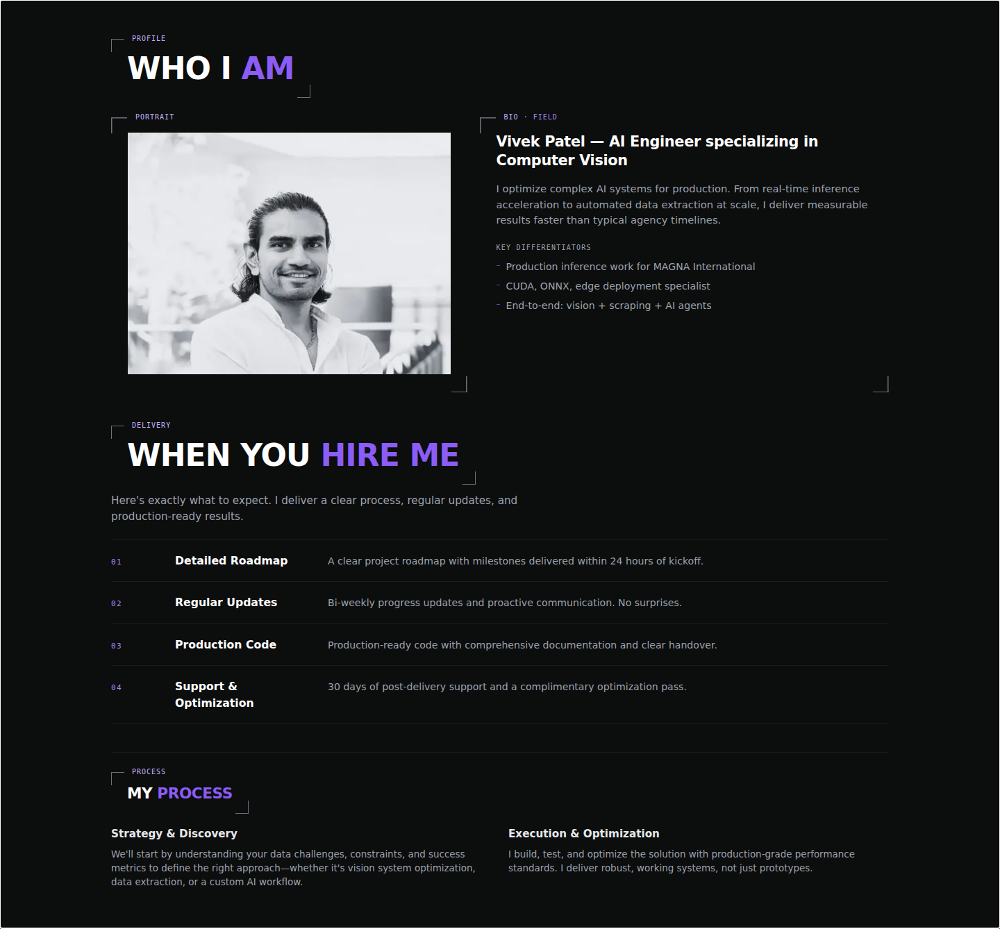
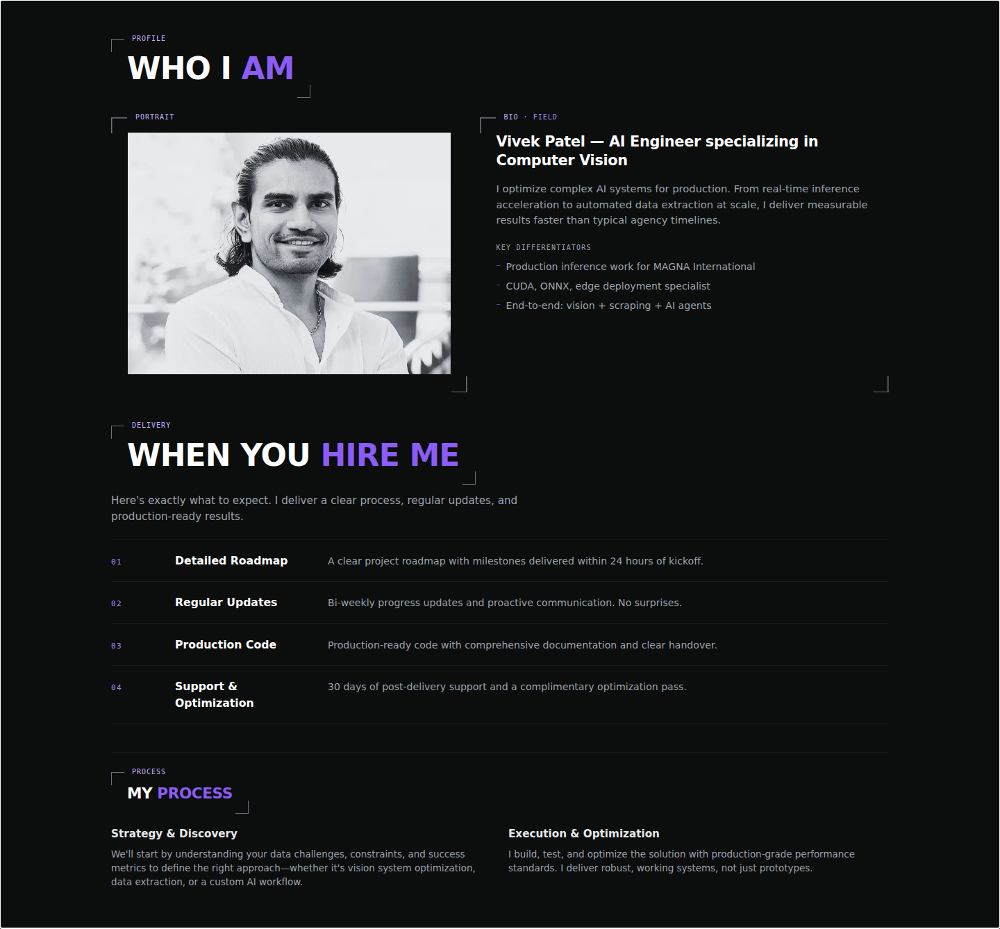
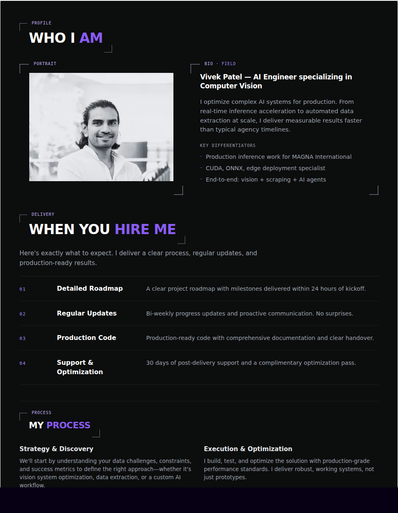
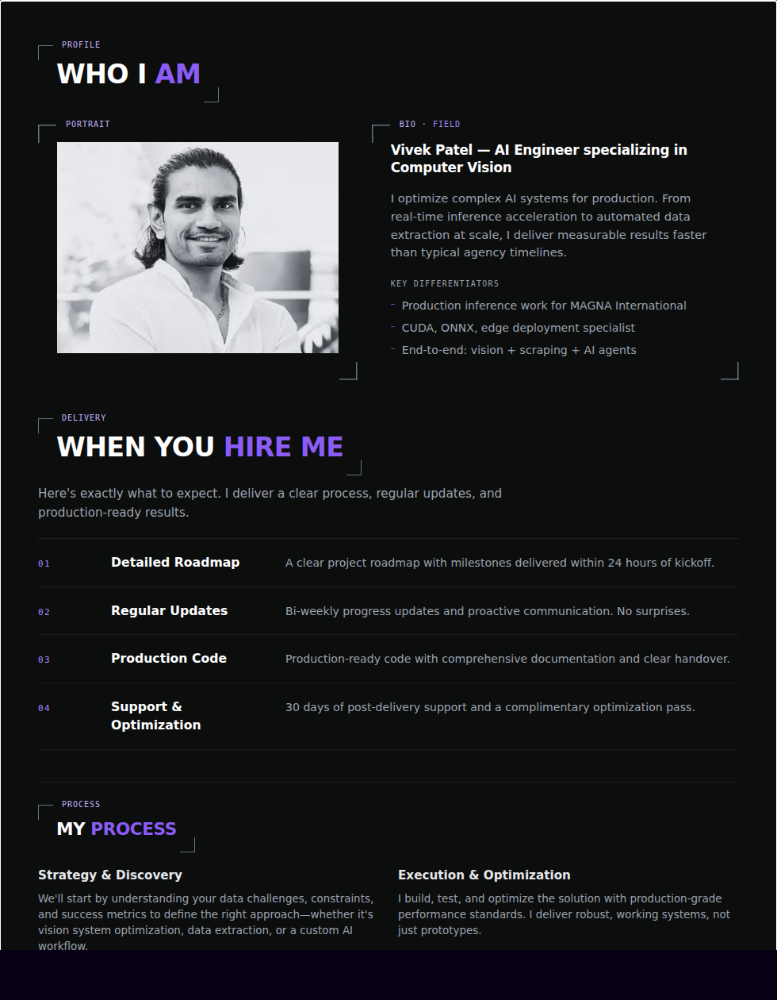
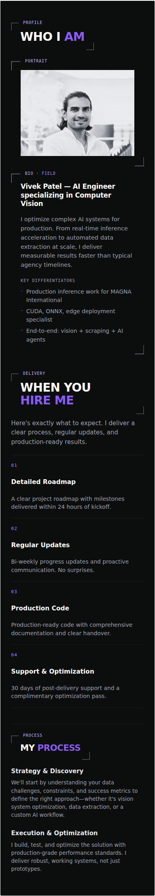
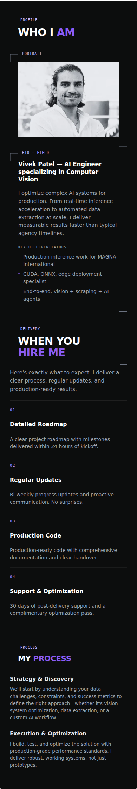
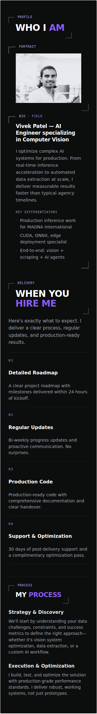
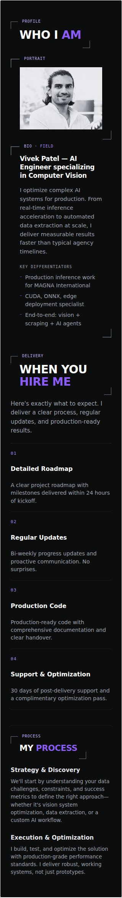
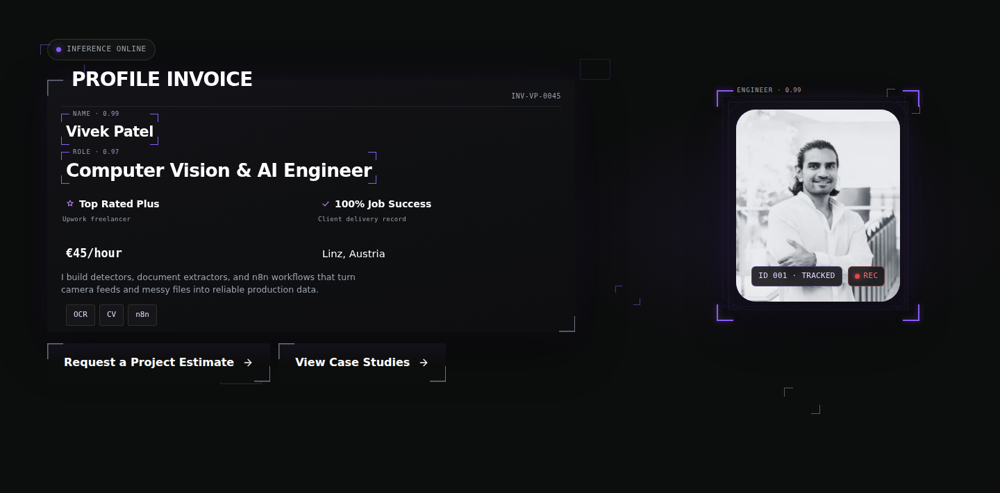

# About portrait refinement — #298

Validated on 4 October 2026 against a local production build based on
`a9556ec` on `develop`. The before build includes the shared corner treatment
from #294. No merge or production deployment was performed.

## Composition

About now uses an independent crop of the
[authentic photograph](../../public/assets/images/vivek-black-and-white.webp).
The face is larger, with the complete hairline, chin, neck, shoulders, and upper
chest visible. There is no generated imagery, retouching, background replacement,
or new animation. Biography text and adjacent sections are unchanged.

The source is 1008 × 1367, SHA-256
`1129fba439219ea8c50dc9b79910b17a5ddab7323b253037f849df2b4699b72b`.
The crop rectangle is `left: 104, top: 118, width: 800, height: 664`.
The first fine hair wisps start at source row 182, or row 64 in this crop.
The photograph retains background above those wisps; the browser removes the
excess headroom without clipping the hair.

The existing photo viewport remains 4:3. The crop is 64 source pixels taller
than an 800 × 600 viewport. With `object-fit: cover` and
`object-position: center calc(100% + 5px)`, the excess height cancels the
landmark's scaled offset and leaves 5 CSS pixels above the hair. This is measured
inside the photograph, independently of card padding and corner decoration.
Fractional frame layout is quantized by Chromium to 1/64 CSS pixel; the measured
landmark differs from 5px by at most 0.008px in these captures. Fine antialiased
wisps do not have a perfectly binary pixel boundary.

Responsive WebP candidates are 400 × 332, 800 × 664, and 1200 × 996, at quality
90. Their filenames include their content hashes. The 1200px candidate is an
upscale of the authentic 800px-wide crop, providing consistent browser candidate
selection without inventing image detail. Sizes are 14.5, 47.9, and 71.4 KiB.

To reproduce each asset with the project's pinned `sharp` version, apply:

```js
await sharp('public/assets/images/vivek-black-and-white.webp')
  .extract({ left: 104, top: 118, width: 800, height: 664 })
  .resize(width, width * 664 / 800) // width: 400, 800, or 1200
  .webp({ quality: 90 })
  .toBuffer();
```

Hash the resulting buffer with SHA-256, name it with the first 12 hex digits,
and update only `aboutPortrait` and `aboutPortraitSrcSet`. The original and hero
candidates are retained.

## Browser verification

Chromium 148.0.7778.96 / Playwright 1.60, actual CSS viewports below, DPR 1 for captures.
T3 preview automation reported no available host. Browser libraries were
extracted into a task-owned temporary directory; no system packages or project
dependencies were changed. Network access in browser checks was limited to the
local production preview.

| Actual viewport | Photo dimensions (CSS px) | Hair landmark (CSS px) | Space below photo inside card | DPR 1 selection |
| --- | --- | --- | --- | --- |
| 1440 × 900 | 464.547 × 348.406 | 4.996 | 26px | 800w |
| 980 × 1324 | 354.781 × 266.078 | 4.992 | 33.156px | 400w |
| 390 × 844 | 286 × 214.5 | 5.000 | 26px | 400w |
| 320 × 844 | 216 × 162 | 5.000 | 26px | 400w |

The photo and card geometry are unchanged by decoding. The existing 980px card
has 7.156px additional space below the photograph because the biography column
is taller; the portrait is balanced inside the whole panel and its padding is
preserved. Corners and the Portrait label remain outside the media crop.

- Cold navigation to `/`, followed by scrolling into the lazy image, passed at
  all four sizes. The crop is checked before and after image responses are
  released to verify reserved dimensions.
- Direct `/#about` navigation passed at all four sizes. The regression checks
  require the image to arrive in view without a test-driven scroll.
- Every referenced About candidate returned HTTP 200, `image/webp`, and decoded
  successfully in the local production browser.
- Existing density checks passed at 390 × 844 @3, 412 × 823 @1.75,
  768 × 1024 @2, and 1440 × 900 @2 for both About and hero.
- The before build also displayed and decoded the original photo at all four
  capture sizes. The earlier broken-image symptom was not reproduced, so no
  speculative loading fallback or asset-failure diagnosis was added.

Full measurements, selected filenames, completion states, and dimensions are
recorded in [measurements.json](about-portrait-298/measurements.json).

## Before and after

Each image captures the whole About section, including the photo panel and
neighboring biography, from the stated viewport.

| Actual viewport | Before | After |
| --- | --- | --- |
| 1440 × 900 |  |  |
| 980 × 1324 |  |  |
| 390 × 844 |  |  |
| 320 × 844 |  |  |

## Hero independence

Before and after hero captures at 1440 × 900 are byte-identical, with SHA-256
`db767ea1383b409d659d4d04f5dcc34aadc4ed4527e4fb3e6cf19ac4be62b5b2`.
The shared source, hero component, and hero responsive candidates are unchanged.
#293 remains separate.



## Checks and review

- The updated About tests failed on the old shared-image implementation, then
  passed with the independent crop. About, hero, and image-asset unit checks:
  57 passed.
- The browser crop regression failed against the before production build by
  selecting the shared original. The updated build passed the crop/loading,
  density, and existing About-layout checks: 13 passed. Direct anchor tests were
  additionally strengthened to require arrival without manual scrolling.
- `npm run build` passed, including image derivative, sitemap, and static-route
  checks. It reported the existing stale Browserslist-data warning.
- Task-scoped `git diff --check` passed. The Impeccable detector reported no
  findings on the changed About UI. Unrelated pre-existing skill/plugin edits
  were excluded from this task.
- Independent code review confirmed crop provenance, dimensions, responsive
  sizing, and hero isolation. Its production-QA scope finding was addressed:
  unreleased #298 assertions skip production projects. This visual evidence
  supplements the geometry test, which references the reviewed hair landmark.

Remote CI and owner review remain PR delivery steps; these local checks do not
authorize merging or a production release.

## Full-CI timing correction

The initial remote passive QA run exposed an intermittent `EncodingError` in
the new cold-scroll test. Immediately calling `decode()` after releasing image
responses raced lazy loading and responsive source selection. The existing
image-density tests already wait for completion before decoding.

The failure was reproduced against the exact production artifact from CI run
`37191527053`: 31 repeated desktop/mobile cases passed and one failed at the
early `decode()` call. After adding the same completion wait, all 32 repeated
cases passed. Decoding, HTTP status, dimensions, and candidate assertions remain
in place; broken or missing images still fail the test. No product or asset
change was required. Remote CI must pass again on the corrected PR head.
