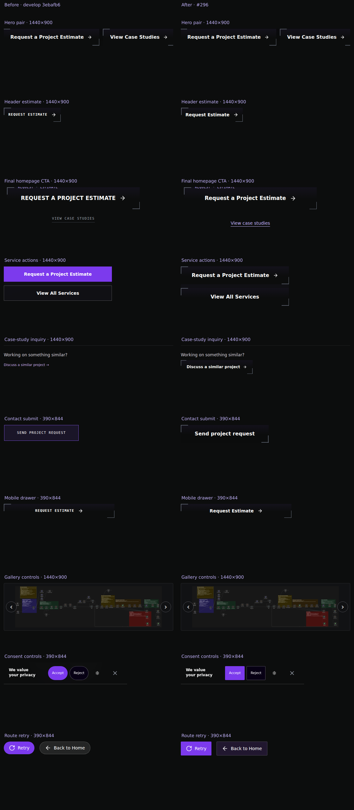
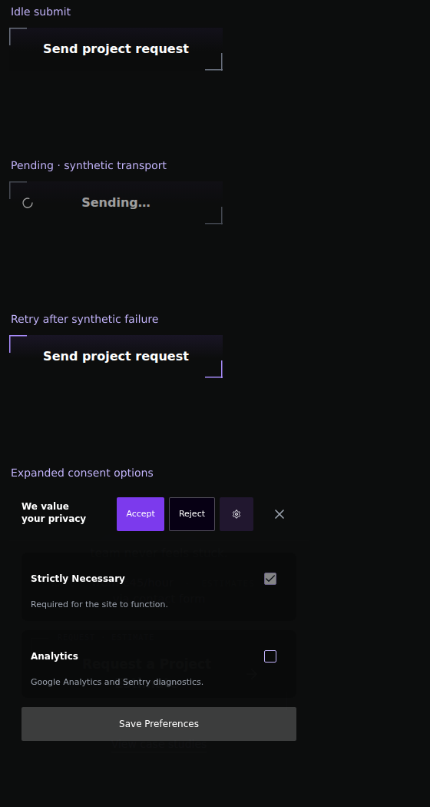

# Shared button family — #296

Baseline: `develop` at `3ebafb65a82194e01f149697b15d56c22589fe66`.
Vivek approved the implementation plan on 4 October 2026 after reviewing the
scope extension. Final rendering and primary-action emphasis still need his
review before merge.

## Approved scope and result

BT-01 extends the existing dark background, subtle purple top, and opposing
corners to service-detail estimate and browsing actions, case-study inquiries,
and contact submission. TY-01 records the approved sans-serif labels with
existing casing, primary weight 650, and secondary weight 600. Compact header
and drawer actions, standard actions, and the large final CTA share these rules.
The final CTA retains its confirmed REQUEST · ESTIMATE metadata.

Text actions remain underlined lightweight links. Menu, consent, retry, and
carousel callers have scoped utility states and 44px targets. Gallery controls
retain their conventional shapes, selected state, disabled controls, and focus
outline. Testimonial hit areas are now 44px on mobile as well as desktop; their
inactive diamond is brighter for indicator contrast. The generic Button and
Checkbox defaults are unchanged. Consent checkboxes retain a conventional 16px
mark inside a 44px target.

Submission reserves the idle label and spinner space while showing Sending….
The button stays the same size during submission. Explicit mobile grid tracks
and a shrinking form panel keep its label inside the form at 320px. Navigation
anchors, destinations, payload, synthetic-tested transport lifecycle, consent,
modal behavior, and publication state are preserved. No dependency or idle
animation was added; reduced motion stops the pending spinner.

## Visual evidence

These are matching local production builds, with analytics disabled and
reduced motion. The before source is a disposable archive of the baseline;
the after source is this branch. The collaborative T3 preview was initially
used, then reported no automation host. The final evidence uses headless
Playwright Chromium 148.0.7778.96 with the same capture process for both builds.
Screenshots contain synthetic contact state only; no live lead was sent.





The sheet covers the hero pair, header, final CTA, service, article inquiry,
contact submit, drawer, gallery, consent, and route retry. Desktop crops use
1440 × 900; contact, drawer, consent, and retry use 390 × 844. Images are scaled
down to fit sheet cells. Primary emphasis follows the approved weight
separation on the existing shared background; owner review should assess
whether that difference reads strongly enough.

Individual after captures: [1440 hero](assets/button-family-296/hero-1440.png),
[980 hero](assets/button-family-296/hero-980.png),
[390 hero](assets/button-family-296/hero-390.png),
[320 hero](assets/button-family-296/hero-320.png),
[320 submit](assets/button-family-296/contact-320.png), and
[390 carousel](assets/button-family-296/carousel-390.png).

## Browser coverage

The production action matrix passes 49 checks across Chromium 148.0.7778.96 and Playwright WebKit 26.4,
normal/reduced motion, and these actual CSS viewports:

| Width × height | Coverage |
| --- | --- |
| 1440 × 900 | Desktop actions and utilities |
| 980 × 1324 | Reported intermediate layout |
| 390 × 844 | Mobile actions, touch drawer, and wrapping |
| 320 × 740 | Narrow actions and utilities without horizontal overflow |

The 15 skipped cases are deliberate duplicates of the one native Chromium
zoom test. Its actual viewport changes from 1440 × 813 to 720 × 406 at 200%,
with visualViewport.scale remaining 1. All five route surfaces reflow and keep
labels within their actions. This is browser zoom, not CSS scaling.

The matrix covers shared geometry, label containment, primary/secondary
weights, hover, keyboard focus, pressed state, exhausted collection actions,
44px text and utility targets, touch drawer closure/focus return, keyboard
carousel selection, consent checkbox toggling, and gallery modal focus return.
It allows 0.01px tolerance for transformed target bounds reported a few
millionths below their 44px CSS dimension.

Color calculations use WCAG relative luminance with alpha colors composited
over their backgrounds. White action text is at least 15.32:1 across the
supported resting, hover/focus, and pressed backgrounds. Purple text/focus
against the pressed action background is 9.26:1. Consent Accept white text is
5.70:1; gallery icons are 15.07:1. Inactive/selected carousel diamonds against
the darkest supported pressed contrast case are 3.02:1 and 3.45:1. Decorative
corners are not the focus indicator; separate outlines remain visible.
Disabled controls retain their distinct styling and are exempt from the
active-control contrast requirement.

Navigation checks cover native modifier/middle clicks, client routing,
keyboard Enter, main-content focus, and drawer restoration. The initial run
passed all 12 Chromium and 6 mobile WebKit checks but had 4 desktop WebKit
timeouts. All 6 desktop WebKit checks passed in an isolated rerun on the final
production build. No navigation code was changed to make that rerun pass.

Reproduction commands (Node 24, locked dependencies, installed Playwright
browser runtimes, and a production preview on loopback port 3000):

```sh
VITE_CONVEX_URL=https://qa-contact-lifecycle.convex.cloud VITE_SENTRY_DSN= VITE_GA_TRACKING_ID= npm run build
npm run preview -- --strictPort
QA_ACTION_OUTPUT_DIR=/tmp/button-family-actions npx playwright test -c tests/qa/qa-action-family.config.js
QA_NAVIGATION_CTA_BASE_URL=http://127.0.0.1:3000 QA_NAVIGATION_CTA_OUTPUT_DIR=/tmp/button-family-navigation npx playwright test -c tests/qa/qa-navigation-ctas.config.js
QA_CONTACT_LIFECYCLE_ARTIFACT_DIR=/tmp/button-family-contact npm run qa:contact-lifecycle
npm test -- --maxWorkers=1
```

The local Ubuntu host required temporary userspace browser libraries and
software rendering for WebKit; these were kept outside the repository and do
not change app dependencies. Build output retains the existing Browserslist
stale-data notice. New checks use the existing loopback guards and isolated
transport fixtures; they do not authorize live submissions.

Full contact lifecycle QA initially passed 87 of 88 checks across both engines,
1280/390 widths, and both motion preferences. Coverage includes draft restore,
reload warnings, pending route remounts, unchanged payload, duplicate blocking,
safe failures, retry focus, receipt focus, and invalid submission. The extended
pending test confirms identical idle/pending button dimensions and a stopped
spinner under reduced motion. The remaining draft-restore check timed out in
its request-draining afterEach hook after assertions; it passes in an isolated
rerun (1 passed). The original full browser run is recorded as 87 passed,
1 teardown timeout, rather than a clean full-run pass.

Production build passes display-image verification, sitemap generation, 36
public-link checks, and static HTML generation for 21 routes. Changed JavaScript
passes the scoped ESLint no-unused-vars/parser check (the repository defines no
lint script). `git diff --check` passes. No TypeScript source changed; the
production build validates the frontend transformation. All 68 unit files
and 847 tests pass on Node 24 with one worker. Earlier parallel-load runs hit
publication fixture timeouts; the isolated full run passed. That full run was
on the issue implementation before integrating upstream `develop` at
`806ff5191d72b1e32dd8a8002ede067826d19806`. The integration preserved the email
card change and CI updates. The combined branch passes 85 affected tests in
Contact, Portfolio, CI-result aggregation, and QA-artifact workflow files,
and its production build passes again. The upstream changes do not alter
the action crops recorded here.

## CI assertion repair

The first remote run passed unit tests, build, contact, motion, telemetry, and
Apache route QA. Passive QA exposed expectations for the previous purple
service fill and previous footer/collection focus colors. Those assertions now
follow the approved family while retaining rendered contrast and painted
corner/focus checks. The obsolete solid-fill helper was removed.

The carousel overlap check compared separate frames during entrance motion.
Capturing all bounds in one synchronous browser evaluation preserves overlap
detection; targets now must be 44px at every width. The collaborative browser
at 390 × 844 measured ten 44px targets in two rows with no overlaps. Application
source did not change in this repair.

Affected production browser checks: 10 passed across desktop/mobile Chromium.
Scoped lint, parser checks, and diff checks pass. Independent standards
and specification reviews found no weakened coverage. Remote CI must pass on
the repaired head before the authorized merge into develop.

## Review and limits

Independent specification and repository-standards reviews found no remaining
code findings after fixing standalone case-study preview CSS and consent target
sizes. The preview renderer now includes the shared action stylesheet; its
existing server test verifies that integration.

The Impeccable detector ran once. Its sole finding was the pre-existing article
blockquote left border, outside this ticket. BT-01 and TY-01 checks cover action
styles; this report does not claim a whole-site theme audit or production
verification. The owner must review the family and primary emphasis before
merge. No production deployment or conversion claim is included.
