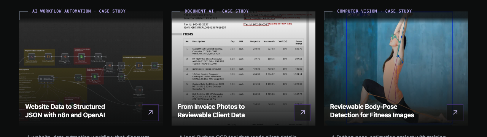
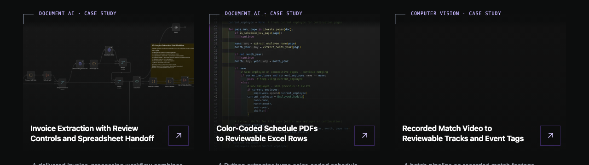
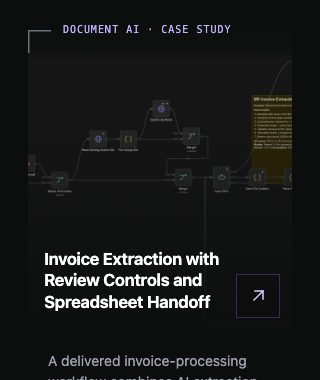

# Case-study label alignment

Vivek's 5 October 2026 review decision lowers the case-study category labels so their line boxes are centered on the top-edge guide established by the corner strokes. Label backgrounds remain transparent. This supersedes the former 3px gap in SH-03.

The shared card-specific offset was removed. Homepage and collection cards now inherit the shared label anchor. A narrow scrim over the top 32px of each thumbnail preserves contrast beneath the centered labels. Wording, typography, corner strokes, media cropping, card links, and grid spacing are unchanged.

## Verification

- The initial 850-test unit suite passed. After integrating current develop and repairing contrast, 849 tests passed in the isolated source snapshot; its one Git ignore assertion required repository context and then passed separately with all nine tests in that file.
- `npm run build` passed, including display-image validation, sitemap generation, static HTML for 21 routes, and 36 public-link checks. Browser verification used the isolated artifact on preview port 3105. One build command accidentally ran in the shared checkout and regenerated its dist; the port 3000 server was left running.
- CI's small-text contrast failure was reproduced before the repair. Sixteen Chromium and WebKit browser checks now pass. They cover all shared card labels at 320px, 768px, and 1280px, the original whole-site small-text contrast check, top-edge centering, transparency, unchanged media position, viewport containment, neighboring-card clearance, and wrapped mobile labels.

The refreshed desktop and mobile captures below show centered transparent labels over the narrow thumbnail scrim. The label itself has no fill. Rendered label contrast meets 4.5:1, including the light invoice and bright fitness thumbnails. An independent verifier passed 14 Chromium/WebKit checks and inspected the wrapped mobile label and refreshed screenshots with no actionable findings. These captures verify local rendering, not production deployment or a complete accessibility audit.

## Visual evidence

Homepage, 1280px:

Collection, 1280px:

Collection, 320px:

