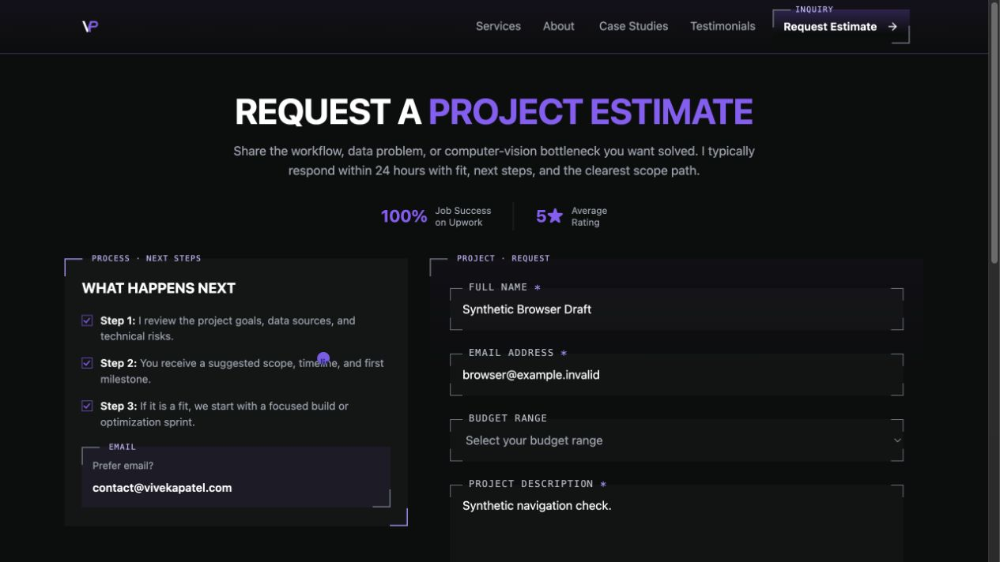

# Contact drafts through case-study navigation

Issue #322, checked on 7 October 2026. The clean task worktree started from fetched `develop` at `8a80ffb834ed9f28edf7eb497f8caa12bc8c4da7`. The branch is `codex/issue-322`. Initial Standards/Spec reviews inspected source/test candidate `e164cf74b2db071f39c279410ba48b5c62705683`. Before landing, the branch integrated `develop` at `045cff49c761f02b2f982333517801a8c421976c` without rewriting published history. Kiro and an independent runtime verifier reviewed integrated candidate `458328e4ef7af6c53ee9490081f79a5b26d0f11a`.

## Behavior and regression evidence

A dirty contact draft survived router navigation to the homepage and featured article, but the article inquiry anchor loaded a new document. The module holding the draft then started empty. Before the fix, the same browser regression failed in Chromium and WebKit with `Expected: "Synthetic QA Contact"`, `Received: ""`. Four ordinary-click unit cases also failed. Commit `0b05113` records those failing tests before the fix.

The article now uses React Router `Link` inside a router and native anchors outside one. The collection home link uses `Link`, matching its existing router-dependent cards. Labels, classes, destinations and gallery links remain intact, consistent with the confirmed BT-01 navigation contract. No contact store, storage policy, collection snapshot or scroll handling changed.

Model the Domain guided the choice of renderer from the existing router context. Test Behavior, Not Implementation guided the assertions on restored field values and actual navigation. No new persistence abstraction was needed.

## Verification

| Check | Result |
| --- | --- |
| Baseline unit suite with loopback permission | 850 passed |
| Targeted navigation, collection, scroll, draft and standalone preview tests | 66 passed |
| Initial complete unit suite | 858 passed across 69 files |
| Complete unit suite after integration | 870 passed across 70 files |
| Final complete contact lifecycle matrix | 116 passed; four documented WebKit middle-click skips |
| Production build | Passed; 21 generated routes and 36 validated public links |
| ESLint on the four changed source/test files | Passed using the installed `react-app` configuration in an external task config |
| Chromium and WebKit draft journey | Passed at 1280×800 and 390×800, with normal and reduced motion |
| Collection explicit return | Twelve loaded cards and departure scroll restored; resume query consumed |
| Collection browser Back and article home | Loaded cards preserved and home arrival at scroll zero |
| Modified click delegation | Ctrl, Cmd, Shift, Alt and middle click remain unprevented in both engines |
| Native Ctrl/Cmd tabs | Correct destinations and unchanged source tab in both engines |
| Native middle-click tabs | Passed in Chromium; headless WebKit limitation below |
| Generated no-JavaScript content | Both engines checked all twelve article titles, home/back/contact hrefs and media URLs; collection first six cards, remaining six native links and disabled Load more passed |
| Codex in-app browser | Synthetic fields visibly preserved through contact → home → featured article → inquiry |

The new journey asserts zero document navigation requests, zero unload warnings, all four restored fields, continued dirty-draft unload protection, no synthetic field values in localStorage/sessionStorage/current history state, and zero transport mutations. Existing lifecycle tests cover real reload confirmation, clearing after confirmed reload, draft memory across route remounts and pending synthetic submissions. No real inquiry, email or telemetry submission was made.

Run the durable regression matrix with an unused loopback port and external output directory:

```sh
QA_CONTACT_LIFECYCLE_PORT=4403 \
QA_CONTACT_LIFECYCLE_ARTIFACT_DIR=/tmp/contact-draft-navigation-322 \
npm run qa:contact-lifecycle
```

The standalone static generator and preview renderer are covered by the unit suite and build. The no-JavaScript browser check used the built preview on port 5403, blocked non-loopback requests and disabled JavaScript before navigation. Contact destinations were checked as native links to `/contact/`; this does not claim a no-JavaScript contact form.

An earlier full lifecycle run passed its assertions but hit one Chromium mobile timeout while draining intercepted requests in `afterEach`. The final full run and the focused rerun are recorded separately; this was not treated as a passing first run. Initial disposable static checks incorrectly assumed a SPA `main` wrapper and JavaScript contact form in generated HTML. They were corrected to check the actual static markup and ticket's destination contract.

## Review and remaining verification

Independent read-only Standards and Spec reviews inspected pinned base-to-candidate diffs, including the final browser tests. Both found no actionable source defects. The Standards review also found no added explanatory comments or unnecessary abstractions.

Kiro ran with the tracked `portfolio_frontend_review` profile, configured for `claude-opus-5.5`, high effort, v2 and read-only `read,grep,glob` tools. Earlier approval attempts were rejected before Kiro ran. After the exact diff was published and GitHub confirmed PUBLIC repository visibility, automatic approval review allowed the public-source review. Kiro returned PASS+NOTES with no blocking source defects. Its session context names the requested model, but no served-model attestation was provided. The [actual Kiro output](contact-draft-navigation-322/kiro-review.txt) is retained.

Kiro's two test findings were addressed by matching the exact home URL, polling home scroll after a homepage element is visible, and asserting browser Back scroll restoration as well as loaded-card count. The computed destination prop was an acceptable maintainability note; no extra wrapper or static caller changes were added. A future internal prose link could reload the document, but Kiro found no current internal prose destinations. That latent possibility does not justify expanding this fix.

An independent verifier who did not author the implementation returned PASS+NOTES after fresh Chromium/WebKit desktop and mobile draft journeys, modified event checks and native Ctrl/Cmd popup checks. The first run had ten passing cases and two Chromium teardown timeouts after their assertions passed. A fresh bounded recovery of those exact cases passed both in 2.2 seconds. The [independent verdict](contact-draft-navigation-322/independent-verification.md) records inherited baseline evidence and fresh runtime evidence separately. The landing head is verified separately before merge; the initial verdict is not substituted for a changed head.

macOS headless WebKit navigates the original tab when middle-clicking a plain native anchor. An isolated native-anchor control reproduced that behavior; Ctrl/Cmd-click opened a new tab normally. Only WebKit's four native middle-click popup cases are skipped, with the reason in the durable tests. Unprevented middle-click event checks pass in both engines. Actual Safari middle-click remains a manual follow-up. Current WebKit and desktop viewport checks do not establish historical Safari or physical-device behavior.

The plain-anchor control recorded `button: "middle", opened: false, sourceURL: "http://127.0.0.1:5403/contact/"` and `modifiers: ["ControlOrMeta"], opened: true, sourceURL: "http://127.0.0.1:5403/"`.

The PR keeps `Refs #322` because actual Safari middle-click verification remains pending. The user explicitly authorized babysitting and merging this PR into `develop`, then cleaning up its worktree. No production deployment is authorized.

## Browser evidence

The screenshot uses synthetic fields after the article inquiry return. The browser draft was cleared and the temporary tab closed after capture.


