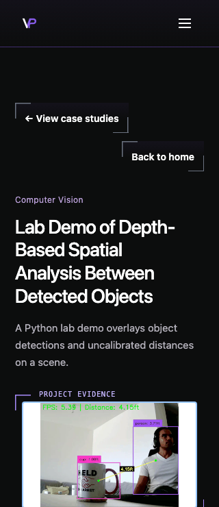

# Evidence label clearance, issue #327

Inspected `develop` at `8a80ffb834ed9f28edf7eb497f8caa12bc8c4da7` on 7 October 2026. The task started from a clean, isolated worktree. [Issue #327](https://github.com/vivekpatel99/my-portfolio-webisite/issues/327) authorizes this standalone-cover spacing repair. [Issue #294](https://github.com/vivekpatel99/my-portfolio-webisite/issues/294) is related context only.

The shared label has a 16px line box centered on the frame's top edge. Standalone media began at that same edge, putting the lower 8px of the label over bright image pixels. A 12px inset on `.case-study-cover-stage` leaves 4px between the label's line box and the media. No badge, image crop, media-source change, or shared-frame change is required.

SH-02 confirms transparent `PROJECT EVIDENCE` labels and opposing corners. SH-03 confirms the shared frame geometry and transparent edge attachment. Its space reservation clause is a proposed default; its visibility and media-cropping clauses are existing references. This repair implements the ticket's scoped inset without promoting those clauses to sitewide confirmed decisions.

## Rendered evidence

Each PNG is a full viewport capture of the real locally built depth route, with its original-image link focused. Actual CSS viewport dimensions match the filename. Before captures use the inspected baseline. After captures use the 12px inset. Current installed Playwright Chromium and WebKit were tested on macOS. These are resized desktop engine checks, not historical-engine or physical-device evidence.

| Actual viewport | Chromium before | Chromium after | WebKit before | WebKit after |
| --- | --- | --- | --- | --- |
| 1440×900 | [Before](assets/evidence-labels-327/before-chromium-depth-1440x900.png) | [After](assets/evidence-labels-327/after-chromium-depth-1440x900.png) | [Before](assets/evidence-labels-327/before-webkit-depth-1440x900.png) | [After](assets/evidence-labels-327/after-webkit-depth-1440x900.png) |
| 980×1324 | [Before](assets/evidence-labels-327/before-chromium-depth-980x1324.png) | [After](assets/evidence-labels-327/after-chromium-depth-980x1324.png) | [Before](assets/evidence-labels-327/before-webkit-depth-980x1324.png) | [After](assets/evidence-labels-327/after-webkit-depth-980x1324.png) |
| 390×844 | [Before](assets/evidence-labels-327/before-chromium-depth-390x844.png) | [After](assets/evidence-labels-327/after-chromium-depth-390x844.png) | [Before](assets/evidence-labels-327/before-webkit-depth-390x844.png) | [After](assets/evidence-labels-327/after-webkit-depth-390x844.png) |
| 320×740 | [Before](assets/evidence-labels-327/before-chromium-depth-320x740.png) | [After](assets/evidence-labels-327/after-chromium-depth-320x740.png) | [Before](assets/evidence-labels-327/before-webkit-depth-320x740.png) | [After](assets/evidence-labels-327/after-webkit-depth-320x740.png) |

Codex in-app Browser also reproduced the bright-image overlap on the production build and showed the readable label after the inset. Its development preview initially appeared blank without reported console errors; the built route rendered normally. Acceptance captures and automation use the production build on loopback port 5408.

## Verification

`tests/qa/qa-evidence-labels.spec.js` tests all three current standalone image covers and the invoice multi-image gallery at each viewport in both engines. Local-only network guards block external transport. The suite is registered only for preview projects; safe artifact mode suppresses screenshots, and the sanitizer recognizes the suite.

- Baseline browser regression run had 24 standalone clearance failures and 8 gallery passes. The decisive assertion was `the whole edge label clears the media`; at Chromium 1440×900 the label bottom was 482.03125px and media top was 474.03125px.
- After the inset, all 32 browser cases passed. Standalone cases check transparent labels, image aspect ratio, original source link, alt, caption, real display and original decoding, keyboard focus and Enter activation, and document overflow. Gallery checks cover arrow selection, enlargement, Escape, focus return, label/control clearance, and original decoding.
- Baseline unit suite passed all 850 tests in 68 files. Targeted gallery checks passed all 30 tests. Production builds passed before and after the CSS change.
- The Impeccable detector reported the pre-existing blockquote side border. That unchanged style is outside #327.
- No lint or typecheck script or project configuration is supplied in `package.json`; no such passing result is claimed. JavaScript syntax, unit tests and production compilation cover the changed source.

The final unit suite passed all 850 tests in 68 files. The 46 QA configuration and sanitizer tests passed independently. The same 32 browser cases passed with `QA_ARTIFACT_SAFE_MODE=1`, which suppresses raw captures. `git diff --check` and changed JavaScript syntax checks passed. Existing test output includes intentional React error-boundary diagnostics and jsdom navigation notices. Builds report stale Browserslist data; no dependency refresh was added to this ticket.

Independent Standards and Spec reviews found no actionable findings. The Spec reviewer inspected all four depth captures. The scoped comments review found no added comments or suppressions and requested no deletions. Kiro review follows the committed candidate before PR delivery.

No production deployment or live inquiry, email, lead or telemetry write was performed.
