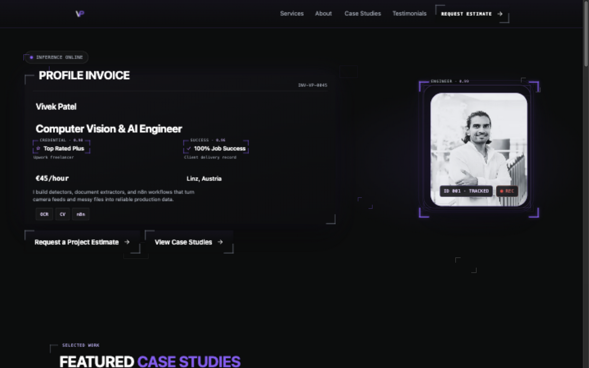
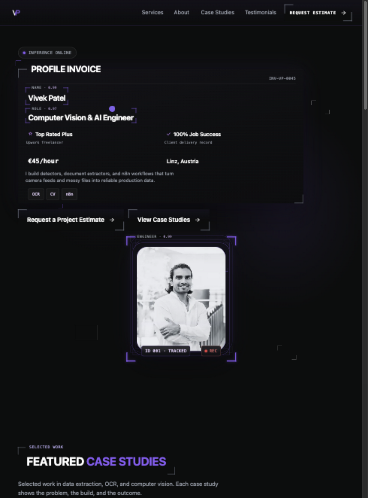
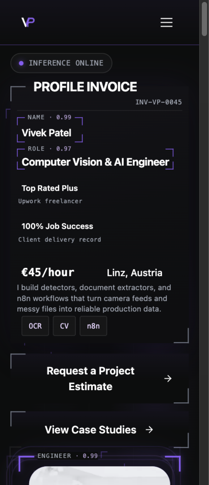
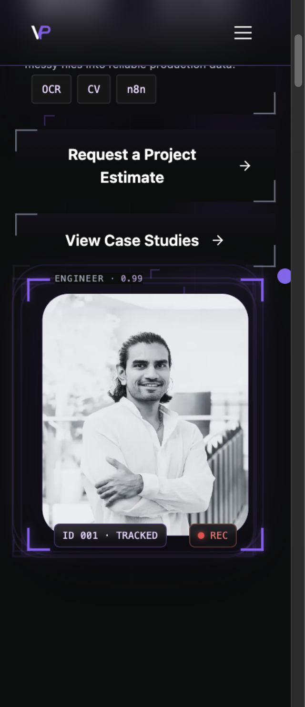

# Hero OCR labels: responsive acceptance follow-up

Checked on 4 October 2026 against a local production build of `develop` at
`4190720a05e631e6908c843fa2344646022ce59f`, including portrait PR #302.
Issue: [#297](https://github.com/vivekpatel99/my-portfolio-webisite/issues/297).

## Reviewed behavior preserved

Vivek confirmed in this task that PR #300's later decisions take precedence over
the original issue: six fixed field scores, two rotating annotations at a time,
fading inactive labels, static topic chips without a Tags score, and no OCR
subtitle or manual Pause control. See DESIGN.md OC-01 through OC-03 and MO-01,
and the [earlier implementation report](hero-ocr-labels-297.md).

The label attachment and responsive geometry are already implemented and pass
the checks below. This follow-up changes tests and review evidence only. It does
not change field values, animation logic, padding, actions, or portrait assets.
PR #302's About crop is present. The hero uses its separate original portrait;
the closer hero crop remains issue #293's scope.

## Validation

The existing OCR tests check all three pairs at actual CSS viewports of
1440 × 900, 980 × 1324, 768 × 900, 390 × 844, and 320 × 740. They verify:

- Every field label starts 17px from its frame edge: a 12px stroke and 5px gap.
- Labels retain at least 17px clearance from the opposite corner, remain within
  their columns, and leave values below them inside the frame.
- Scores and label rectangles remain fixed across rotation and reduced motion.
- The portrait label starts 29px after a 24px stroke, centers on the outer guide,
  and leaves clearance for the opposite corner.
- The page has no horizontal overflow. The Role remains the single semantic h1.
- Real animation-frame sampling confirms no more than two annotations at once,
  shared label/corner opacity, stationary values and actions, reduced-motion
  suspension, and offscreen suspension.

The desktop and mobile Chromium batches each pass 21 tests with one expected
pointer-mode skip, for 42 passes and two skips. Six spacing checks pass at 320,
390, 720, 768, 1024, and 1440px.

The existing native Chromium zoom test now checks all six labels and scores,
both corner clearances, value containment, neighboring columns, the portrait
anchor, and unchanged geometry across all three pairs. It starts with reduced
motion and then verifies normal rotation. Actual viewport measurements are
1440 × 813 before zoom and 720 × 406 after `chrome.tabs.setZoom(..., 2)`;
`visualViewport.scale` remains 1. This is browser zoom, rather than pinch zoom
or a half-width approximation. The test records these dimensions in its
`native-zoom-viewport` annotation.

The spacing helper now waits for the first-visit consent banner to appear and
finish entering before measuring. Previously its delayed appearance could move
the page between measurements or after the initial geometry snapshot. This
preserves first-visit coverage rather than hiding the banner.

The production build passes image-derivative checks, bundling, sitemap generation,
and static output checks for 36 links and 21 routes. The targeted Hero,
detected-field, and QA artifact-workflow unit suites pass 53 tests. JavaScript
syntax lint and `git diff --check` pass. No repository ESLint configuration is
present, so the lint invocation uses explicit module syntax and environment
options; it is not a repository-wide lint claim.

Linux browser verification uses the installed Playwright browser with
`PLAYWRIGHT_HOST_PLATFORM_OVERRIDE=ubuntu24.04-x64` and local shared libraries.
The native-zoom browser's additional Avahi libraries were downloaded and
extracted into the task's temporary directory without a system install.

## Visual review

The original [desktop baseline](hero-ocr-labels-297/before-desktop.jpg) and
[mobile baseline](hero-ocr-labels-297/before-mobile.jpg) show labels before
attachment. The following captures show the current implementation, including
the accepted PR #300 behavior. No additional UI change separates this task's
before and after states.

The shared browser reports the CSS dimensions above; screenshot raster sizes
vary with its display scaling. The portrait tag remains outside the photograph
and clear of the face. The mobile Role wraps within its field. Automated
measurements cover all pairs, including states absent from a particular capture.

Keep #297 open with `Refs #297` until Vivek's visual review passes. This report
does not establish WebKit or Firefox acceptance, a whole-site theme audit,
completion of #293, or production deployment. No merge or release is included.

## Delivery and cleanup

The starting branch is `t3code/implement-issue-297`, with a clean dirty-file
baseline. Task-owned repository files are this report, its six images, and
`tests/qa/qa-responsive.spec.js`. The existing managed checkout is retained for
PR review and any CI repair; retire it after those dependencies finish. Ignored
`node_modules/` and `dist/` are retained for reproducing the review build. The
task's preview process, disposable test captures, logs, downloaded libraries,
and temporary baseline are removed after verified PR delivery.
