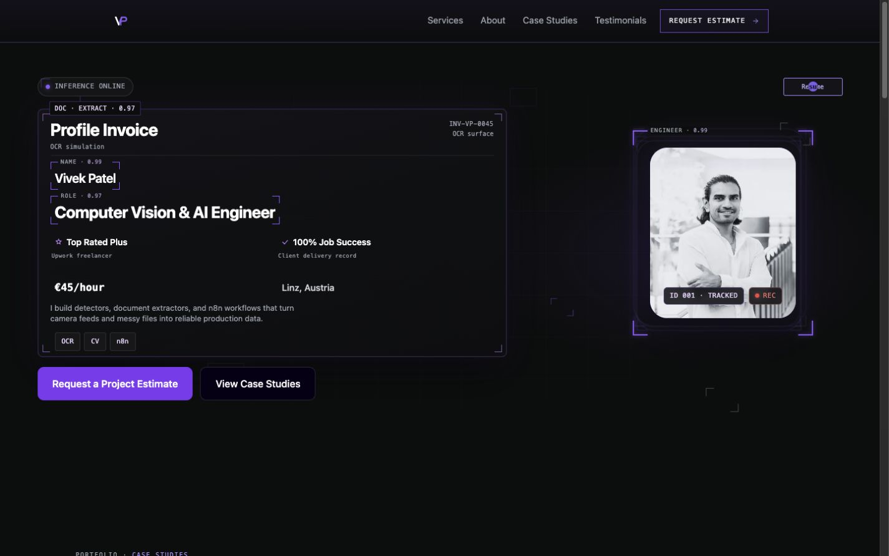
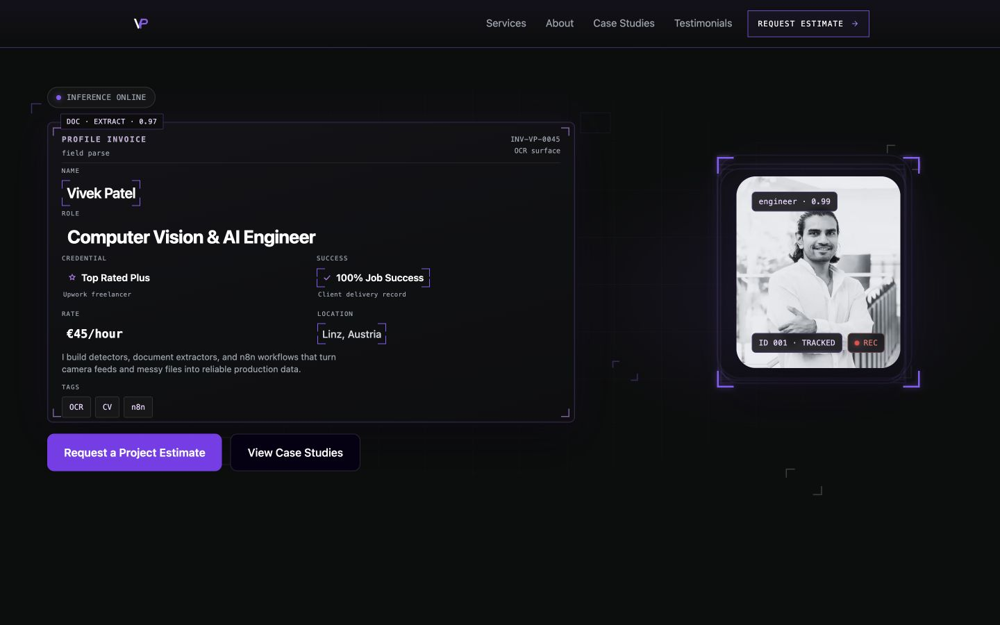
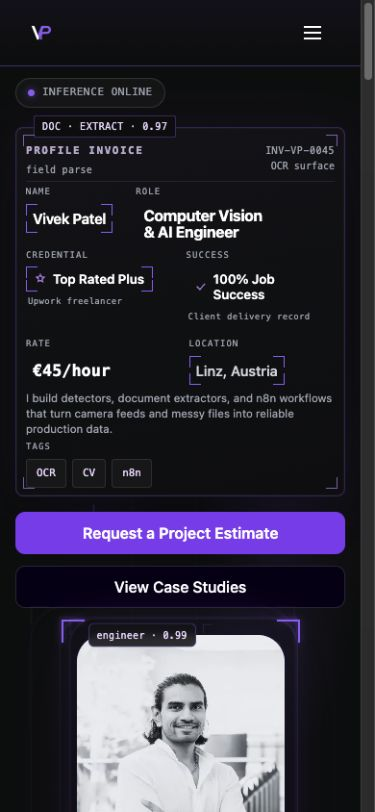
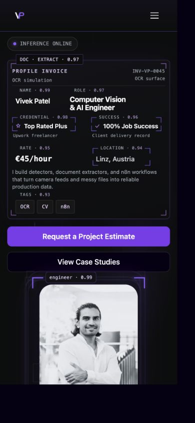
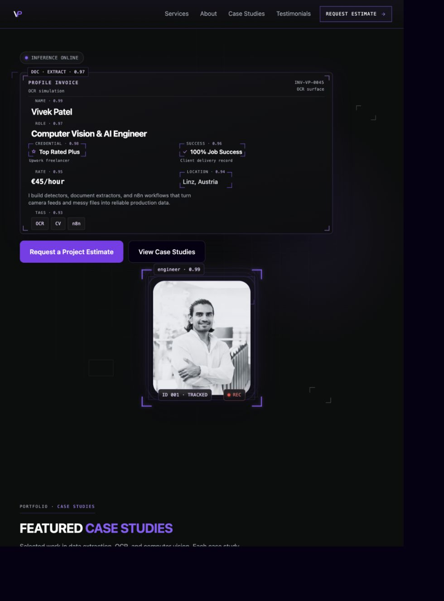
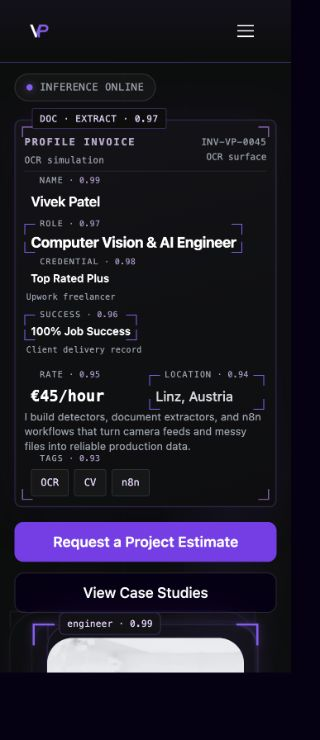

# Hero OCR annotation experiment

Issues [#297](https://github.com/vivekpatel99/my-portfolio-webisite/issues/297) and [#292](https://github.com/vivekpatel99/my-portfolio-webisite/issues/292), checked on 3 October 2026 against a local production build. The original baseline is `develop` at `70298941554c2e4c3dd5c8f20736914ca59ee5dd`.

## Current experiment

Vivek requested two bounding boxes at a time, moving down the invoice card and returning to the top. The three row pairs are:

1. Name and Role.
2. Credential and Success.
3. Rate and Location.

Pair changes follow a two-second cadence. Both outgoing annotations fade out over 100ms; then both incoming annotations fade in over 100ms. Boxes, labels, and fixed confidence scores share opacity. All actual values, the Role h1, and actions remain visible and stationary. OCR, CV, and n8n remain visible as static secondary chips, without an extraction label or score.

This experiment supersedes the earlier three-highlight cycle, the Rate exclusion, and the requirement that inactive labels remain visible. It records the latest decision against the guide's OC-02 and MO-01 rules. The guide itself remains in the separate documentation PR [#299](https://github.com/vivekpatel99/my-portfolio-webisite/pull/299). This is an experiment for visual review, with permanent frames available as a later alternative.

## Label and portrait attachment

The six rotating invoice labels retain their fixed illustrative confidence scores. `Tags · 0.93` is removed because the topic chips are not detected fields. The header says `OCR simulation`. Each field uses one intrinsic grid for its label and value. A label begins 17 CSS pixels from the frame's left edge, leaving a 5px gap after its 12px corner stroke. Its 12px line box is centered on the 6px top-edge guide. Hidden annotations keep their reserved row and geometry.

The portrait tag begins 29px from the strongest outer frame's left edge, leaving a 5px gap after its 24px stroke. Its vertical center matches that frame guide within half a CSS pixel. The engineer annotation now uses the same plain grey label and quieter score treatment as the invoice fields, with no outlined badge, rounded box, padding, or blur. Lower badges, portrait source, factual values, h1, invoice outer padding, and action destinations remain intact.

`Profile Invoice` is now a bold white sans title, 28px on the reviewed desktop viewport, above the role's 26.4px text. It remains a div; `Computer Vision & AI Engineer` remains the single semantic page h1.

Confidence scores are display constants. Rotation changes the selected annotations, never their numbers. There is no OCR service, tracking event, or new network request.

## Motion and controls

A compact native Pause/Resume button has full accessible action names, a 44px hit area, and visible keyboard focus. Pause settles the selected pair and clears its timer. Resume starts a full two-second interval. Reduced motion uses the static Name/Role pair with no annotation transition or timer.

The selection also stops when the document is hidden, the hero is offscreen, and the component unmounts. Returning starts a full interval without catch-up. One cleanup-owned timeout schedules the dwell and fade phases. No live region or field focus stops are added.

## Desktop verification

Vivek requested desktop/laptop verification only until the animation direction is agreed. The final browser checks use an actual 1440 × 900 CSS viewport. The Codex browser remains open at that size with the animation running.

- All three pair states pass label clearance, value containment, fixed-score, and portrait-anchor checks.
- A real six-second cycle reaches Credential/Success, Rate/Location, and Name/Role in order. Field and action rectangles remain unchanged.
- More than 100 animation frames are sampled across the handoffs. At most two annotations are visible on every sampled frame; label and corner opacity agree on every frame.
- Pause/Resume works through Space and Enter with focus retained. Reduced motion and offscreen suspension freeze the selection, and resuming waits a full interval.
- Existing desktop hero motion checks pass. One coarse-pointer test is intentionally skipped on the desktop fine-pointer configuration.
- Direct Codex-browser interaction confirmed the two selected field wrappers and Pause/Resume state. The same desktop preview is available for feedback.

The earlier desktop batch passed 10 cases with one expected skip. For this cleanup, all five targeted annotation cases pass at 1440 × 900, including the three pair states, per-frame handoff sampling, keyboard Pause/Resume, reduced motion, and offscreen suspension. This pass also checks the enlarged title, single h1, static chips, absence of Tags metadata, and border-free portrait label. Desktop hero motion tests were run on the earlier experiment, not repeated for this styling cleanup.

## Automated verification and review

The full unit suite passes all 828 tests in 68 files, including timer cleanup during both fade phases, hidden/offscreen state, live reduced motion, and unmount. The production build passes image derivative checks, bundling, sitemap generation, and static output checks for 36 public links and 21 routes. Scoped ESLint and `git diff --check` pass.

Fresh independent Standards and Spec reviews cover this cleanup before commit. The Spec review prompted the final title hierarchy adjustment, followed by a build and desktop-check confirmation. The scoped Impeccable detector reports no findings. No animation logic changes are included.

The Model the Domain principle led to an explicit row-pair table and local phase state. The Prove It Works principle led to real desktop frame sampling and direct control interaction.

To repeat only the final desktop annotation checks after starting a loopback production preview:

```sh
QA_LOCAL_ONLY=1 QA_PREVIEW_URL=http://127.0.0.1:4310 npx playwright test -c tests/qa/qa.config.js --project preview-desktop --grep 'OCR labels stay attached at 1440x900|three-pair cycle|annotation controls'
```

## Deferred acceptance

Desktop visual agreement is pending. Mobile, tablet, narrow-width, native zoom, and other browser-engine verification of this final two-pair experiment are deliberately deferred at Vivek's request. The existing responsive test matrix is prepared but has not been rerun for this experiment. Earlier intermediate runs do not establish a pass for the final behavior.

Keep both issues open with `Refs #297` and `Refs #292` while visual agreement and deferred verification remain pending. The experiment differs from their original highlight count and inactive-label policy. No merge or production deployment is included.

## Visual evidence

The desktop screenshot captures the current cleanup in the Name/Role state. The earlier clip shows the unchanged top-to-bottom cycle before the title, engineer-label, and Tags cleanup; it does not show those final visual changes.



[Earlier desktop animation clip, before visual cleanup](hero-ocr-labels-297/desktop-animation.webm)

### Original desktop baseline



### Earlier label-attachment evidence

The following mobile and tablet captures record the earlier label-attachment implementation, before the two-box experiment. They are retained for comparison and do not verify its current responsive behavior.









## Cleanup delivery scope

The cleanup continues draft PR #300 on `codex/297-hero-ocr-labels`, from `195cd720a378adb3a85b5c3a35f5ccaa02a38124`. The baseline and recovery material in `/private/tmp/hero-297-Q7c4` and its parent-owned preview process are preserved. A separate feedback preview is retained at `http://127.0.0.1:4310/`, using `/private/tmp/hero-cleanup-300-rbrV/after-dist`. Its task directory keeps the captured dirty-state baseline and ownership record while feedback remains pending. Disposable verification logs and runner configuration are removed after delivery. The ignored local `dist/` directory was rebuilt; no tracked generated output is added. Pre-existing untracked files remain untouched.
