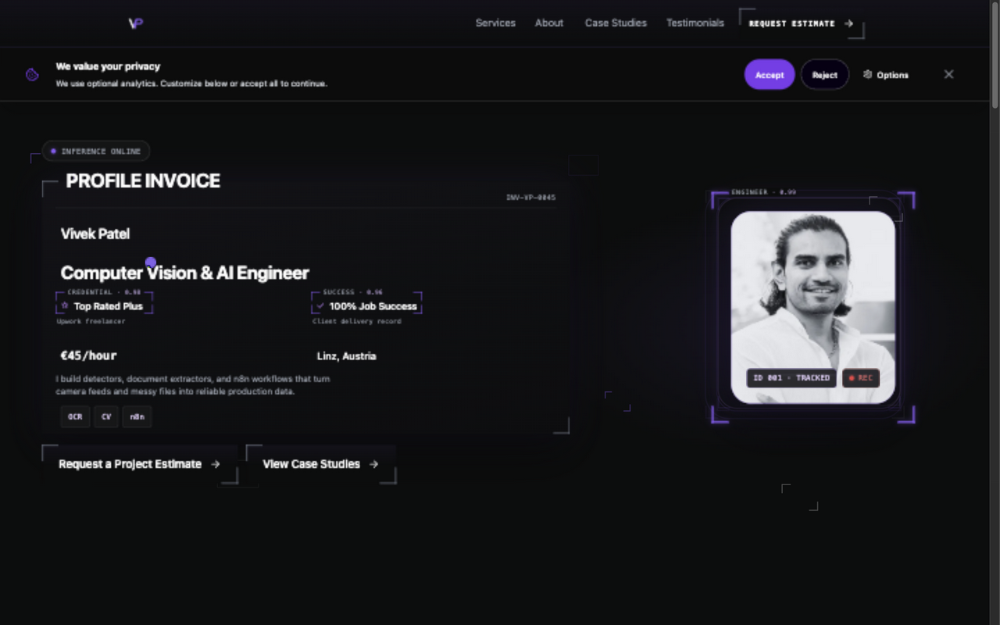
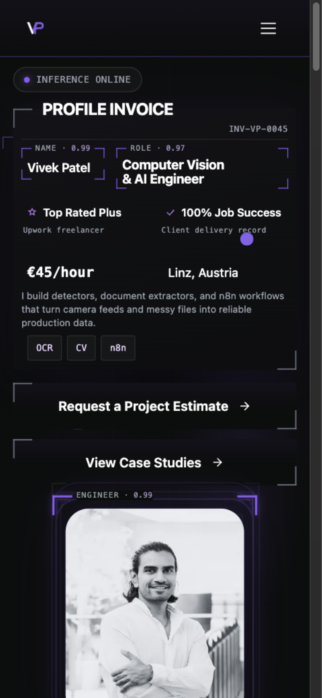
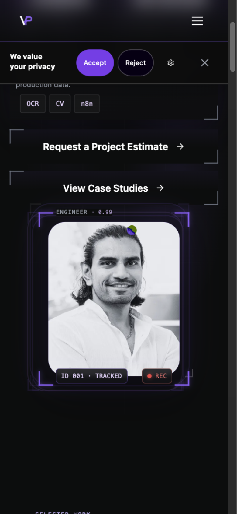
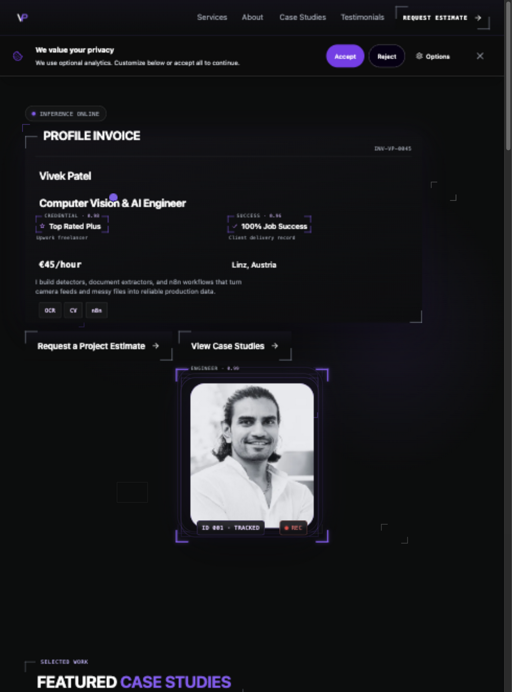
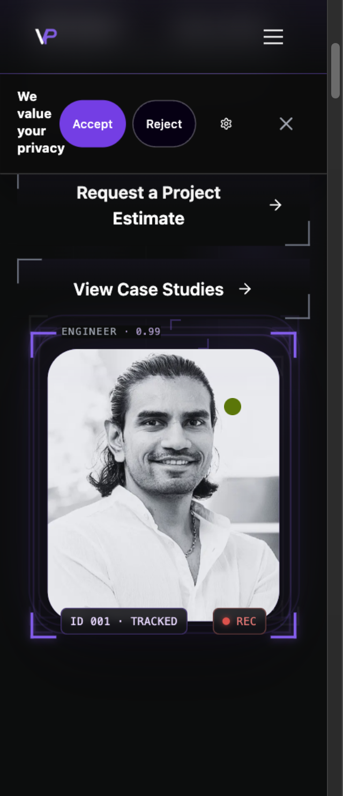
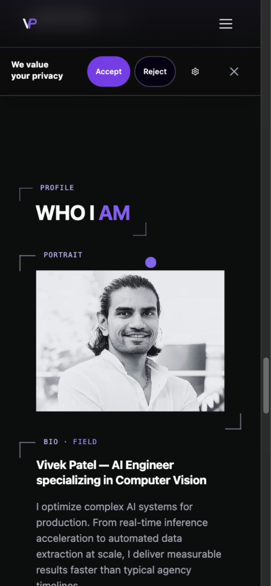

# Closer hero portrait with 3px hair headroom

Issue [#293](https://github.com/vivekpatel99/my-portfolio-webisite/issues/293),
implemented on 4 October 2026 from `develop` at `4190720`.

Vivek requested a closer face crop, then specified exactly 3 CSS pixels above
the topmost hair after reviewing the initial preview. The final crop preserves
the full head, neck, shoulders, and chin while removing most of the folded arms
and torso. The original photograph and responsive derivatives are unchanged.

## Implementation

The photograph is 180% of the existing frame width, centered horizontally.
The reviewed original hair landmark is y=182 in the 1008 × 1367 source.
At this scale its vertical offset is `182 / 1008 × 180 = 32.5` percent of the
frame width. A container-relative image top of `calc(3px - 32.5cqw)` therefore
places the hair exactly 3px below the photograph edge at every viewport.

The frame retains its `362 / 424` aspect ratio, sizes, rounded corners, and
surrounding layout. An absolutely positioned image avoids changing layout
bounds. `overflow: clip` prevents scrolling the page to the oversized image
from scrolling the crop internally; `overflow: hidden` could allow that
programmatic scroll and cut off the hair. The upper engineer label and lower
ID/REC badges retain their existing positions.

Responsive `sizes` now describes the enlarged source image: approximately 425px
on desktop and 389px on mobile, inside the unchanged 236px and 216px frames.
DPR 1 and 2 receive enough source pixels. DPR 3 can require more than the
authentic 1008px original contains; the browser must select that largest source
rather than an artificially enlarged derivative. No new image, request type,
backend behavior, or animated zoom is added.

The About component, its independent crop assets, and image configuration are
unchanged. DESIGN.md records the newly confirmed hero headroom independently
of the existing 5px About headroom.

## Verification

- Production build passes derivative checks, bundling, sitemap generation, and
  static output checks for 36 links and 21 routes.
- Hero, About, and image-configuration unit suites pass all 57 tests.
- All 11 portrait browser cases pass, including 1440 × 900, 980 × 1324,
  390 × 844, and 320 × 740 at DPR 1 and 2, plus the existing DPR 1.75/2/3
  density cases. Assertions cover 3px hair headroom, chin and face containment,
  unchanged frame ratio, sufficient source detail, inability to scroll the crop,
  and identical image bounds when switching to reduced motion.
- All 15 label-geometry cases pass across the existing responsive matrix.
  Reduced-motion/offscreen suspension and four applicable hero motion checks
  also pass; the desktop coarse-pointer case is skipped as expected.
- The initial combined browser run exposed a delayed-render annotation handoff:
  a fixed 100ms timer could advance before the outgoing CSS fade was painted,
  briefly showing four annotations. The repaired handoff waits for the rendered
  outgoing opacity to finish before selecting the next pair. Regression tests
  cover delayed fades and cancellation on hidden tabs, offscreen suspension,
  reduced motion, and unmount. The existing pair order and cadence remain.
- Crop assertions run only against preview projects until deployment. Production
  density checks still run against the existing public portrait. CTA geometry
  measures the visible clipping frame, with consent already settled and reduced
  motion enabled so measurements cannot straddle entrance animations.
- After the CI repairs, all 51 Hero and detected-field unit tests pass. All
  30 repeated browser cases pass: the full real-time cycle and four CTA layouts
  in both desktop and mobile projects, repeated three times. The sampler keeps
  its minimum 100-frame requirement, maximum two annotations, synchronized
  label/corner opacity, and stationary values.
- The full unit run passes 846 of 847 tests; the unrelated publication fixture
  build exceeds its existing 180-second timeout while browser checks are also
  running. An isolated rerun passes all 18 publication tests in 144.57 seconds.
  This is recorded rather than claimed as a single full-suite pass.
- JavaScript syntax lint and `git diff --check` pass. The scoped Impeccable
  detector reports no findings. No repository-wide lint or cross-engine browser
  acceptance is claimed.

Shared-preview measurements at the requested CSS widths confirm the 3px hair
guide, with approximately 0.004px rounding on the 216px frame. Screenshot raster
dimensions vary with the shared browser's display scaling.

## Integration conflict verification

After `develop` merged #299 at `bcff90a`, the only conflict was in DESIGN.md's
IM-01 portrait rule. The resolution retains #299's clause status wording and
the confirmed 3px hero headroom without changing the separate About rule.
The integrated production build passes and all 847 unit tests in 68 files pass
in one run (155.46 seconds). No component code conflicted.

## Visual evidence

The before captures were recorded for #297 at the same `develop` UI baseline.
The after captures show the final 3px crop. All are unedited browser screenshots.

Vivek authorized merging the reviewed closer portrait into `develop` after
checks pass. This completes #293 on integration; production release remains
a separate approved release step.

## Delivery and cleanup

The starting checkout was clean on `t3code/implement-issue-297` at `4eb581f`.
The task branch `t3code/293-closer-hero-portrait` starts from current `develop`.
The previous PR #303 remains available independently. Task-owned paths are
Hero.jsx, its unit test, the responsive and OCR QA suites, DESIGN.md, this report, and
its screenshot directory.

The existing managed checkout and port 4318 preview remain in use for visual
review and CI repairs. Stop the preview and retire the checkout when those
dependencies end. The task directory `/tmp/hero-293-MXbjau` retains the baseline,
ownership record, and preview log while that server is active. Disposable test
captures, unused snapshots, and verification logs are removed after delivery.
The production-only test preview is stopped. Existing ignored dependencies and
the rebuilt `dist/` are retained for reproducing the result.
