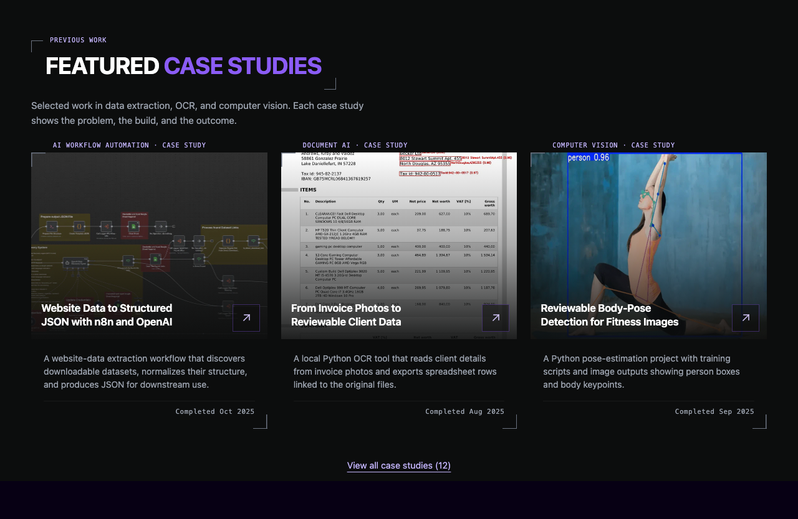
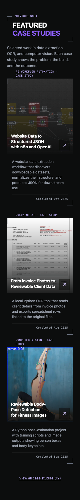

# Previous work section label

Requested on 5 October 2026: attach `Previous work` beside the Featured Case Studies heading's top-left corner, matching Service Offers. TY-01 and SH-02 record this scoped decision.

The homepage uses the existing `DetectionHeading` component. Its decorative label has a transparent background, no confidence score, and `aria-hidden="true"`. The semantic h2 remains `FEATURED CASE STUDIES`, with its original typography, content, and frame dimensions. No other heading or card changes in this PR.

## CI follow-up

The original passive QA assertion compared raw h2 text and rejected the added decorative label. The repaired test verifies the unchanged accessible heading name, then checks the exact `Previous work` label, its `aria-hidden` attribute, and transparent background. Both configured Chromium projects for this visual test passed against the isolated production build.

## Verification

- All 850 unit tests passed across 68 files, including the existing semantic Portfolio heading checks.
- Display derivative validation, the production Vite build, sitemap generation, and static generation for 21 routes passed using temporary output outside the repository. Static output checks covered 36 public links.
- Chromium checks passed at 1280, 768, 375, and 320 CSS pixels with reduced motion. At each width the label matched Service Offers' computed typography and placement, had a transparent background, and stayed within the frame's corner clearances. Its line-box center matched the top-edge guide exactly, with a 25px left offset. Removing the label from the DOM left the heading's bounding box unchanged. No page horizontal overflow appeared.
- Desktop and narrow screenshots were visually inspected. The heading retains its existing narrow-screen wrap.

This is local verification. Owner visual acceptance, integration CI, and production release remain separate. The preceding card alignment PR #310 is independent; these captures show the card layout on this PR's `develop` base.

