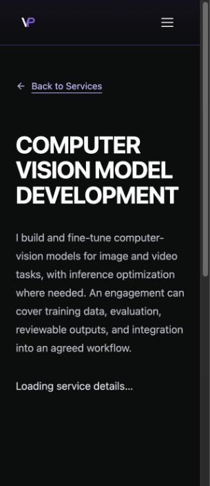
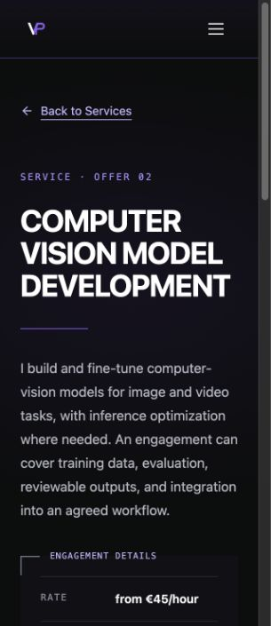

# Service route loading verification

Issue [#328](https://github.com/vivekpatel99/my-portfolio-webisite/issues/328), verified locally on 7 October 2026. Inspected and fetched `develop` baseline `8a80ffb834ed9f28edf7eb497f8caa12bc8c4da7`. The task used its own managed checkout and `codex/issue-328` branch.

## Result

`Layout` previously rendered an empty Suspense fallback after `createRoot` replaced the static service HTML. Holding the production `ServiceDetail` chunk reproduced a missing heading: expected one accessible h1, received zero. The regression was committed before the fix.

`RouteLoading` derives the current service from the existing registry. It presents that service's heading and summary, Back to Services, visible loading status, and current metadata. The site's navigation remains available. Suspense replaces this pending context with the completed route. The existing error boundary and lazy-route retry continue to own recovery. The loading status retains the marker that defers retry focus until final content arrives.

This is a scoped fallback change. The static generator and publication pipeline retain their existing behavior. The pending layout reuses the existing service heading, text, spacing, and link styles. It follows TY-01's existing one-h1 reference and LY-01's proposed readable wrapping guidance. No theme decisions changed.

## Browser coverage

The durable regression is `tests/qa/qa-service-loading.spec.js`. It is registered only for local passive QA in Chromium and WebKit, including the CI artifact sanitizer. The mobile cold-load tests inspect both 390px and 320px, and desktop tests inspect 1440px. Each service is held before assertions, then released before final assertions.

| Scenario | Chromium | WebKit |
| --- | --- | --- |
| Each of three services pending and ready at 1440px, 390px, 320px | Passed | Passed |
| One visible h1, exact service summary and current metadata | Passed | Passed |
| Pending Back to Services keyboard focus and mobile navigation drawer | Passed | Passed |
| Navigate away and select another service during the shared chunk hold | Passed | Passed |
| Failed service, keyboard Retry held pending, final heading focus | Passed | Passed |
| Late chunk rejection after leaving retains homepage content and metadata | Passed | Passed |
| Unknown service pending noindex and final shared 404 | Passed | Passed |
| Each no-JavaScript service's static content and metadata | Passed | Passed |

The initial service matrix passed 40 tests; the expanded final suite passed 56. Its [sanitized result summary](service-loading-328/results.json) records only allowlisted suite names and outcome counts. A second run with the repository Chromium/WebKit desktop and iPhone device configurations passed 96 tests across the service, route-recovery, and route-metadata suites. No-JavaScript output is verified through the static `#root`, which does not include the JavaScript layout wrapper. Its default indexability is preserved without requiring an explicit robots tag.

Codex in-app browser independently reproduced the empty baseline, displayed readable candidate context, followed Back to Services to another held service, and observed final content after release. The following screenshots show that service at a measured CSS viewport of 320 by 740, with device pixel ratio 1. The browser capture files are scaled to 305 by 705 pixels. They are viewport checks, not physical-device or historical Safari evidence.

## Checks and limits

- Baseline and final full suite: 68 files, 850 tests passed. Includes static-route integrity and publication isolation tests.
- Targeted existing layout, error boundary, lazy-route and service-data tests: 58 passed.
- QA configuration and artifact sanitizer integration tests: 46 passed.
- Production build: passed; 21 static routes generated and 36 public links checked. The service remains a lazy production chunk.
- Scoped ESLint using installed `eslint-config-react-app`: passed. Existing dependency warnings remain for the old Browserslist data and the preset's undeclared Babel plugin.
- No dedicated repository lint or frontend typecheck script is configured. No TypeScript or Convex files changed.
- Apache fixture: attempted, unavailable because the local Docker daemon socket was absent. Run `npm run qa:apache-services` with Docker available, or use the CI Apache job, for real `.htaccess` hosting verification. Vite preview is not Apache hosting evidence.

These are controlled pending-content and recovery checks. No real network loading duration, CLS metric, or CLS budget conclusion was measured. No real inquiry, email, analytics-consent grant, deployment, or production release occurred.

## Independent review

### PR follow-up verification

PR review identified focus loss when a keyboard user focused the pending Back to Services link and the chunk then resolved. A production-preview regression reproduced an inactive final link. The fallback now transfers focus to the equivalent completed-page link only when the removed pending link had focus, the URL is unchanged, and no other element has gained focus. It does not move focus from the header. The updated local matrix passed 100 cases across service loading, recovery, and metadata. The integrated full suite passed 873 unit tests in 70 files; the production build and scoped React lint also passed. The cold-service cases assert the transfer in Chromium and WebKit; a separate release case asserts that header focus stays put.

Integration updates preserve the service-loading, evidence-label, and fragment suites in the QA configuration and sanitizer. The whole-site theme checklist now describes the visible pending context. GitHub's Apache job passed on the preceding integration candidates; the local Docker limitation above still applies.

Read-only Standards and Spec reviews of frozen candidate `70b170e2ddb135736e713e46bf8a1eccd851215e` against the inspected baseline found no actionable defects. The comment review found no new comments or suppressions to remove. The candidate is a local snapshot object used to pin review, not the delivered branch HEAD.

Kiro completed one read-only review through the tracked `portfolio_frontend_review` profile, configured for `claude-opus-5.5`, with `--effort high` and V2. Its stream confirmed high effort. It exposed no served-model attestation. The [actual review response](service-loading-328/kiro-review.md) is preserved.

Kiro found no blocking defects. Its advisory findings were assessed separately:

- The pending intro has different geometry from the final service intro. The screenshots confirm a visible content repositioning after release. Exact position parity and a CLS budget are not acceptance criteria for this ticket. No CLS conclusion is claimed, and a shared-intro refactor is deferred.
- The heading, paragraph and Back to Services styles reuse existing class strings. A new shared module would expand this small fallback change, so the existing service registry remains the shared factual source.
- The existing retry loading-label dependency is preserved and guarded by the held-retry/final-focus regression. Introducing a replacement protocol is deferred.
- Shared pending behavior for Contact, Legal and Data Policy, first-visit consent at 320px, and trailing-slash static entry are covered by additional browser checks after the review. The resolve callback named `reject` was renamed `releaseFailure`.
- Kiro's statement that the change adds no entry-bundle code is too broad. The data and imported utilities were already eager, but `RouteLoading` adds its own rendering code. No bundle-size improvement is claimed.

The additional checks address runtime hypotheses with local synthetic transport. Screen-reader announcement delivery in VoiceOver remains unverified. The visible loading text and semantic status are present; browser automation does not prove native assistive-technology speech.
