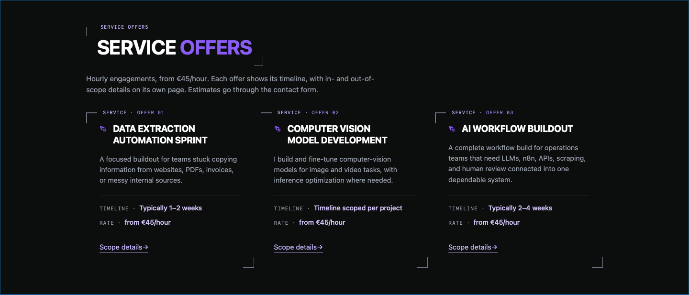
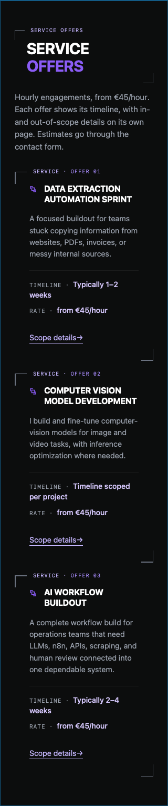

# Service offers browser compatibility

Issue [#324](https://github.com/vivekpatel99/my-portfolio-webisite/issues/324), verified locally on 7 October 2026.

## Change and baseline

The inspected and fetched `develop` baseline was `8a80ffb834ed9f28edf7eb497f8caa12bc8c4da7`. The task began in a clean, dedicated managed worktree on a detached HEAD, then created `codex/issue-324` from that baseline.

`Services.jsx` split summaries with a positive lookbehind. The baseline production bundle emitted `n.split(new RegExp("(?<=\\.)\\s+"))[0]`. The resolved Vite 6.4.3 target includes `safari14`, while [WebKit's Safari 16.4 release announcement](https://webkit.org/blog/13966/webkit-features-in-safari-16-4/) identifies that release as adding RegExp lookbehind.

The replacement matches through the first period followed by whitespace, using a positive lookahead. It returns the original text when no boundary exists. It preserves periods, embedded newlines, empty strings, decimal points, and the existing treatment of question marks and exclamation marks. The browser target, catalog, markup, classes, routes, rates, and timelines remain unchanged.

## Verification

| Check | Result |
| --- | --- |
| Baseline suite with both service test files excluded | 67 files, 840 tests passed with loopback access. The existing service-card tests also passed in the initial sandboxed run. |
| Compatibility regression on original source | Failed with `SyntaxError: Runtime does not support RegExp lookbehind` while rendering the Safari 14 transformed component. |
| Targeted final tests | 2 files, 22 tests passed, including the original card tests and 11 representative summary cases. |
| Full final suite, `npm test -- --maxWorkers=2` | 69 files, 862 tests passed. |
| Baseline and final `npm run build` | Passed. Final output generated 21 static routes and checked 36 public links. |
| Production JavaScript inspection | All 6 emitted JavaScript assets contain no positive or negative lookbehind. The emitted extractor uses `/^[\s\S]*?\.(?=\s)/`. |
| Targeted ESLint with `eslint:recommended` and React JSX usage rules | Passed for all 3 changed source and test files. Configuration stayed outside the repository. |
| Frontend typecheck and repository lint scripts | Unavailable. `package.json` defines neither script and there is no frontend TypeScript or ESLint configuration. The production build and changed-file lint ran instead. |
| Production-preview browser checks | 8 passed in Chromium 148.0.7778.96 and Playwright WebKit 26.4, at 1440×900, 980×1324, 390×844, and 320×740. |
| Codex in-app browser | Rebuilt homepage inspected with all three summaries, titles, timelines, rates and scope links visible. |

The compatibility regression uses the actual component source, Vite's Safari 14 transform, and a synthetic RegExp constructor that rejects lookbehind. It is a capability regression guard, not a Safari engine emulator. The rendered boundary cases run through the real service component.

Browser checks used the built homepage at `http://127.0.0.1:4405/#services`, blocked non-loopback requests and all WebSockets, and used reduced motion. They verified all three exact summaries, titles, timelines, rates, scope destinations, navigation to the first service detail, no page errors, no horizontal overflow and no text overflow within the cards. Card positions, widths and heights match the baseline within 0.01 CSS pixel. These are resized desktop engines, not physical mobile devices.

Six section screenshots were pixel-identical to the baseline. The two narrow WebKit baseline captures include the sticky header over the section; the candidate captures do not. This capture difference does not establish pixel identity for those two images. The content and geometry assertions passed at both narrow widths. The [bundle inspection](assets/issue-324/bundle-inspection.json) records the actual result.

The initial sandboxed baseline suite could not bind loopback sockets and failed two server tests with `listen EPERM`. The clean baseline and final suite passed with scoped escalation. Existing test diagnostics include jsdom navigation messages, intentionally thrown route-error fixtures, and stale Browserslist data. No warning suppression or dependency refresh was added.

## Historical Safari release gate

Actual Safari 14 was unavailable on this Mac. The installed Safari reports 27.0.1, and the available Playwright WebKit reports 26.4. Neither verifies the oldest supported Safari engine. Before a production release, run the built homepage on an actual Safari 14 engine or device and confirm all offers render, retain their first sentences, and navigate to the correct details without a RegExp syntax error. Record the engine version and result in the release evidence.

This PR uses `Refs #324` to keep that runtime release gate visible. No production deployment or real inquiry, email, lead, or telemetry record was created.

## Independent review

Kiro CLI reviewed the exact staged diff for baseline `8a80ffb834ed9f28edf7eb497f8caa12bc8c4da7` and pinned candidate `56a1035fa0d3c0395f056c35f0f2a78f6651e6e4`. That candidate was an unattached commit object used for review before the branch commit. The configured read-only `portfolio_frontend_review` profile requested `claude-opus-5.5`, with CLI `--effort high`, V2, and only `read`, `grep`, and `glob` tools. The call completed with exit 0. The output has no provider-level model attestation; its model statement relies on session context. The [actual review output](assets/issue-324/kiro-review.txt) is preserved.

Kiro found no in-scope code defect. Its one Low finding identified the baseline-count row as inaccurate because the run excluded the whole service test file. Accepted and corrected the row to state the actual exclusion. The final 69-file, 862-test suite includes all existing service-card tests and the new cases. Kiro also confirmed that historical Safari evidence remains a release gap rather than a demonstrated pass. No recovery call was needed.

### Standards

The implement skill's independent read-only standards reviewer found no actionable violations of repository rules, naming, cohesion, architecture, or maintainability in the pinned diff.

### Spec

The independent read-only acceptance reviewer found no actionable code or scope findings. Recording the historical Safari gap satisfies the ticket's fallback evidence clause, without claiming Safari 14 runtime acceptance. The comment review found no introduced comments to remove or lint and type suppressions. Parent diff inspection, changed-file lint, and whitespace checks also passed.

## Current WebKit captures

