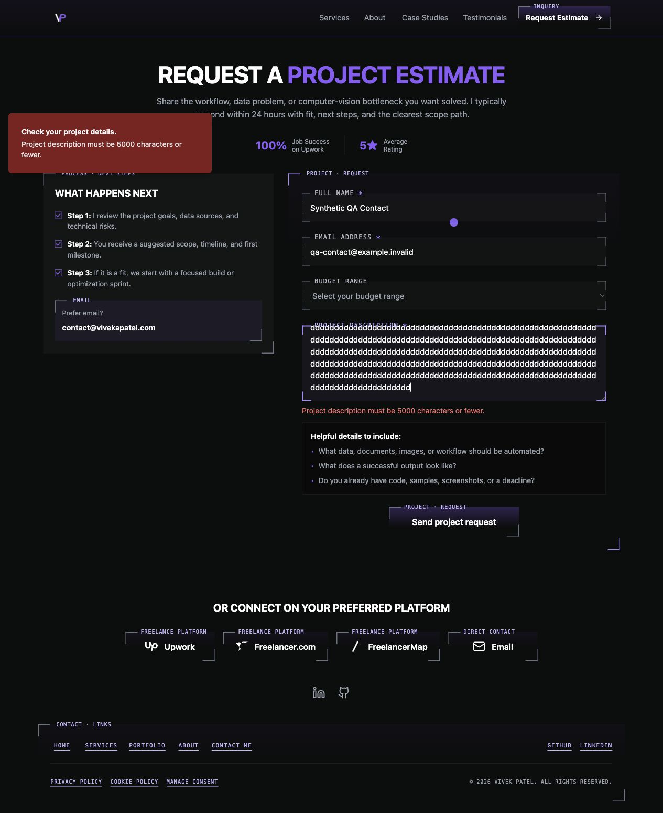

# Contact length-limit validation for issue #325

Issue: [#325](https://github.com/vivekpatel99/my-portfolio-webisite/issues/325).
Inspected `origin/develop` baseline: `8a80ffb834ed9f28edf7eb497f8caa12bc8c4da7`.
The task uses the separately authorized managed worktree and `codex/issue-325` branch.

## Behavior and regression evidence

The browser formerly checked required fields and email format without enforcing backend lengths. Three new component regressions failed because the synthetic mutation was called for a 201-character name, 255-character email, and 5001-character description. The Chromium description reproduction failed because `#description-error` did not exist.

`validateContactFields` now returns either normalized values or field errors. Both the browser and backend use the same rules for name 200, email 254, description 5000, raw bounds, control characters, and budget options. The backend retains its independent unknown-input shape check and generic `ConvexError`. No schema or API argument change is required.

Local invalid submits retain the draft, focus the first invalid field in form order, associate its visible error with `aria-describedby`, and never start the mutation. The correction flow clears each edited error. A disabled temporary option represents an invalid programmatic budget so the user can actually choose blank without losing other fields.

The pstack Model the Domain principle shaped the discriminated validation result. Boundary Discipline kept the shared rules pure and each browser/backend entry responsible for rejection.

## Verification

- Baseline unit suite: 68 files, 850 tests passed. The initial sandboxed run failed two loopback server tests with `listen EPERM`; the permitted rerun passed.
- Final unit suite: 68 files, 866 tests passed. Targeted contact/backend suite: 115 tests passed.
- Convex TypeScript: `node_modules/.bin/tsc -p convex/tsconfig.json --noEmit` passed.
- Production build: passed with a synthetic Convex URL; sitemap and 21 static routes generated successfully.
- Contact lifecycle: Chromium and WebKit, 1280- and 390-pixel viewports, normal and reduced motion. All 120 synthetic cases passed again on the final implementation, including all 32 new boundary/focus cases. There were no skipped browser cases.
- Task files: React-app ESLint diagnostic passed with zero errors and two inherited `no-control-regex` warnings on the unchanged backend control-character regexes. `git diff --check` passed.
- There is no repository ESLint config or lint script. A supplemental full `src` scan using installed `eslint-config-react-app` reported 17 errors and 9 warnings in unchanged files. This is not a clean whole-project lint result. A separate lint configuration/cleanup task is needed. The installed legacy Babel preset also emits its existing dependency notice.
- Codex browser: local desktop WebKit inspection at 1280 × 720, Convex and telemetry disabled. A 5001-character synthetic description retained all text, displayed the 5000-character limit, had `aria-invalid=true` and `aria-describedby=description-error`, and received focus. No horizontal overflow was observed.

Commands used for browser QA:

```sh
QA_CONTACT_LIFECYCLE_PORT=5406 \
QA_CONTACT_LIFECYCLE_ARTIFACT_DIR=/absolute/external/task-directory/contact-lifecycle \
npm run qa:contact-lifecycle
```

These results establish current local engines and resized desktop behavior. They do not establish historical Safari/device behavior or a deployed backend. No real inquiry, lead notification, analytics record, or deployment was created.



## Independent review

The [actual Kiro output](assets/2026-10-07/issue-325/kiro-review.txt) is preserved verbatim. The call used the tracked `portfolio_frontend_review` profile configured for `claude-opus-5.5`, plus explicit `--model claude-opus-5.5 --effort high`, with only read/grep/glob trusted. The direct CLI avoided the shared wrapper's known output-cleanup defect. No shared/global settings changed.

Kiro reviewed initial candidate `ea1b83d9674e374e373e1cda42150584fb86da6f` against the baseline and reported no blocking defects. It could not attest the actual model or effort, loaded no skill files, and did not run runtime checks. This was a bounded source/diff review, not a complete design critique.

Both nonblocking findings were verified and fixed:

1. Raw sizes now guard normalization of oversized fields. Existing raw caps and canonical error messages remain enforced.
2. An unmatched programmatic budget previously displayed blank without allowing a change back to blank. A regression reproduced that mismatch; the temporary option and correction test now pass.

Kiro's notes about UTF-16 length counting and toast titles depending on fixed strings do not identify a current acceptance defect. UTF-16 counting matches the existing backend contract. Native email controls strip surrounding whitespace, so browser draft assertions use the actual displayed value; programmatic normalization is tested separately.

The implement skill's isolated Standards and Spec reviewers found no actionable findings on the initial candidate or the final incremental candidate `ba88a753a60439ddc907ff9de1602d9b083cc85a`. The comment review removed one redundant new test comment. No unrelated application changes were made.
