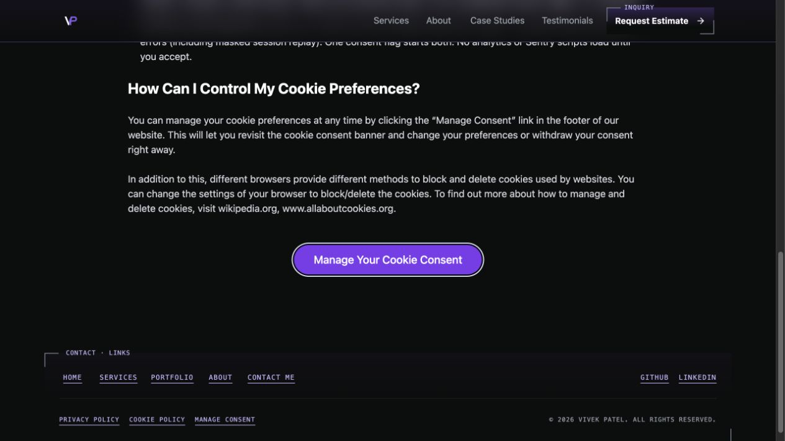
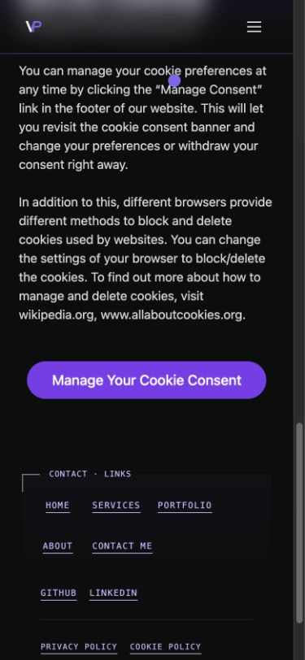

# Cookie-policy consent opener verification

Issue [#329](https://github.com/vivekpatel99/my-portfolio-webisite/issues/329).
Verified locally on 7 October 2026 from `develop` commit
`8a80ffb834ed9f28edf7eb497f8caa12bc8c4da7`, with a clean starting worktree.
Branch `codex/issue-329` owns only the opener, its regression tests and this evidence.

## Result

The opener is a native `type="button"` named Manage Your Cookie Consent.
Mouse, Enter and Space use the existing `manage-cookies` event. The handler
focuses its current target without scrolling before dispatch, so the existing
manager records the correct return target even when WebKit mouse clicks do
not focus native buttons. Close, Reject and Save Preferences return focus.
The shared Button, consent storage, vendor settings and utility classes are unchanged.
This preserves DESIGN.md BT-01's action semantics and approved utility treatment.

## Verification

- The Codex browser reproduced the original link semantics and Space failing
  to open the manager. New component regressions failed because no named button existed.
- A native-button-only candidate passed ten browser cases but failed both
  WebKit mouse focus-return cases. Explicit opener focus fixed those failures.
- `npm test -- --maxWorkers=2` passed 854 tests across 69 files after final edits.
  Existing local-server tests required scoped loopback access. The first sandboxed
  baseline run failed those socket binds; it was not treated as a product failure.
- Targeted opener, banner, Layout and consent component tests passed 37 cases.
  Analytics-off and analytics-on preferences are covered with telemetry mocked.
  A form wrapper verifies that opening never submits a surrounding form.
- `npm run build` passed after the final product-code edit, including generated
  display-image checks, 36 static public links and 21 generated routes.
- All 24 opener cases passed using the actual CI project selections
  `preview-desktop`, `preview-mobile`, `preview-webkit-desktop` and
  `preview-webkit-mobile`. The new cases live in `qa-focus.spec.js`, which
  all four projects select. They check native type, activation, manager focus,
  unchanged URL/storage and focus return at 390px and 1440px.
- The complete neighboring consent suite passed 44 cases across Chromium and
  WebKit before those six opener cases moved to the focus suite. An earlier run
  overlapped unit/build work and had eight footer/skip-link focus failures.
  An isolated baseline-module comparison passed all 16 affected neighboring
  cases; rerunning the candidate suite after other processes finished passed all 44.
- Browser QA used loopback port 4410, a baseline-module override on port 5410,
  external configurations/output paths, `QA_LOCAL_ONLY=1`, blocked service workers,
  and the repository's HTTP/WebSocket guards. No real inquiry, telemetry or vendor
  record was created.
- The Codex browser confirmed identical 306.367px by 48px utility dimensions,
  purple fill, white 18px text and pill radius. At 390px the control fits within
  the viewport. Keyboard dismissal restored focus with a visible 2px ring.
  These are current local browser and resized-viewport observations, not
  historical Safari or physical-device evidence.
- `git diff --check` and ESLint JSX parsing passed for the changed JavaScript.
  The repository has no configured lint script, frontend typecheck script or
  frontend TypeScript project; no full lint or typecheck pass is claimed.
  Existing test diagnostics, jsdom navigation messages and stale Browserslist
  warnings remained visible and did not fail the checks.

## Review

Independent standards and specification reviewers reported no findings.
The comment review retained only the required Vitest jsdom environment directive.

[Kiro's captured source review](2026-10-07-issue-329-kiro-review.md) found no
product defect. Its CI-selection gap was fixed by moving the regression cases
into the existing cross-browser focus suite. Its preference-test gap was fixed
with an analytics-on component case. Its ignored Testing Library `exact` option
was verified against the installed implementation and removed.

The repeat-opener hypothesis describes existing behavior outside this ticket.
Keyboard focus styling was checked in the Codex browser. The actual browser
Save Preferences cases include the real toast and retained opener focus.
Kiro's partial skill loading is disclosed in the captured review; it is not
claimed as a whole-site design or accessibility audit.

All ticket acceptance criteria are verified locally. Remote CI and production
behavior remain separate checks. No merge or deployment is authorized.

## Screenshots

