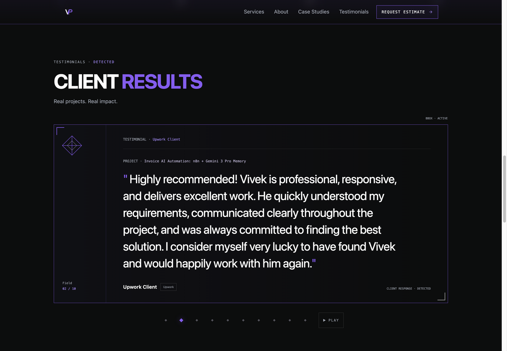
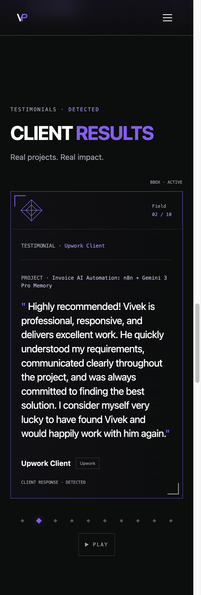

# Testimonial playback controls for issue #225

Verified on 30 September 2026 against `develop` at
`8fe91fb930275289bfe1f8f1f1ec3d0083e226f4`. This change targets `develop`.
Issue [#225](https://github.com/vivekpatel99/my-portfolio-webisite/issues/225)
remains open pending acceptance, required checks, review resolution, and merge.

## Reproduction and fix

Codex reproduced the original defect in the local production build at 390×844
with normal motion. Selecting Slide 2 yielded `02 / 10`, then `03 / 10` after
6.5 seconds. No Pause control existed. Inactive targets measured 5×5 CSS px;
the active target measured 8×8 CSS px.

The quote and controls now share one interaction boundary. User pause, hover,
focus, and reduced motion independently stop rotation. Selecting a slide
persists until Play. Focus on the quote or any control stops rotation; after
Play, rotation waits for focus and hover to leave.

Slide targets are unrotated 32×32 CSS px below 640 px and 44×44 CSS px at 640 px
and above.
The existing 5 px and 8 px diamond marks remain inside those targets. The
Pause/Play control is at least 44 px high. Controls wrap on narrow screens.
Quotes, source labels, rail, brackets, and the approved purple identity remain.

Reduced motion shows `Autoplay off · Reduced motion` instead of an ineffective
Play action. Manual selection remains available. Diamond transitions use
explicit properties and stop under reduced motion.

Codex also reproduced a preference-change edge case during verification.
Removing a focused playback control left focus pausing stuck while the actual
focused element was `BODY`. The rendered probe failed with `01 / 10` unchanged
after 7.5 seconds. Synchronizing focus within after preference-driven DOM changes
fixed it; the same rebuilt production probe passed. Genuine quote focus and
persistent user pause survive preference changes.

## Verification

- `npm test` passed 572 tests in 54 files, including 20 testimonial tests.
- Before the original fix, the focused file had 10 failures and 8 passes.
  The additional focus-removal regression failed before its fix and passed after.
- `npm run build` passed. Static output checked 36 links and generated 21 routes.
- Chromium desktop/mobile passive and carousel checks passed 222 distinct cases
  across the final runs. The full run had 221 passes and three skips; after
  removing an unnecessary mobile motion-test skip, that case passed separately.
  The two remaining skips cover platform-specific interactions.
- Selected WebKit desktop/mobile carousel checks passed 12 distinct cases.
  The initial run had 11 passes and one unnecessary mobile skip; that case
  passed separately after the skip was removed.
- Browser checks covered actual 20.5-second pause persistence, synthesized tap,
  Enter/Space activation, Tab order, focus outlines, quote/control focus holds,
  overlapping hover/focus reasons, playback resume, target geometry, reduced
  motion, manual selection, and changing the motion preference.
- Codex inspected the rendered production build in T3 at 320, 390, 768, and
  1440 px widths. At 320 px, all ten slide states kept their targets inside the
  viewport without overlap. Keyboard focus showed a 2 px outline.
- `git diff --check` passed. The mechanical design detector reported no findings.

QA used `QA_LOCAL_ONLY=1`, local production previews, and the existing isolated
network fixtures. No real contact submission or production mutation occurred.
To repeat the scoped Chromium checks after a local build, run:

```sh
QA_LOCAL_ONLY=1 QA_ARTIFACT_SAFE_MODE=1 QA_PREVIEW_URL=http://127.0.0.1:3000 \
  npx playwright test -c tests/qa/qa.config.js qa-testimonials.spec.js \
  qa-a11y.spec.js qa-upgrade-interactions.spec.js qa-responsive.spec.js \
  qa-visual.spec.js --project=preview-desktop --project=preview-mobile
```

## Review provenance and limits

Kiro implemented the change with Opus 5.5 selected. The initial headless wrapper
produced edits and checks but returned empty final text; Codex inspected its
actual artifacts independently. The final correction session reported
`claude-opus-5.5` in the active interactive runtime.

A separate Opus reviewer checked requirements and code quality against the
`develop` diff and new browser spec. Its reduced-motion labeling finding was
fixed. The same read-only reviewer rechecked the corrected diff and returned
`Requirements verdict: met`, `Maintainability verdict: good`, and
`approve. No merge blockers remain`. Both interactive sessions reported
`claude-opus-5.5`. The reviewer did not execute browser checks.

Implementation session `sess_53f7ec03-e145-4e1e-9cce-320a995cf028` and independent
review session `sess_7baf1739-0eb1-474b-aee6-63daf4bdc286` retain CLI provenance.
Codex independently inspected source, diffs, rendered behavior, and check output.
Codex also enabled the motion-preference regression on mobile and verified it.

### PR follow-up verification

Both initial hosted CI runs passed unit, build, and browser checks, then failed
artifact reconstruction because the new testimonial suite was missing from the
sanitizer's exact registry. Opus added its bounded suite label and regression
coverage while preserving rejection of unknown sources and production projects.

The published review also identified that default passive QA selected the
unreleased controls against production. Codex reproduced 16 production test
variants with `--list`; the corrected config selects the 16 preview variants
only. Other passive suites, local-only focus projects, and live-contact gates
remain unchanged. The focused tests went from 6 failures and 29 passes to
38 passes across the config, sanitizer, and artifact-workflow files.
`npm run qa:artifacts:verify` also passed.

During monitoring, `develop` gained #238, #240, #242, and #245. The first three
integrated without changing this patch. #245's hero-motion QA registration
conflicted with the testimonial config and sanitizer tests. Opus resolved both
by retaining the preview-only testimonial selection, local-only hero/focus
selection, and both exact sanitizer suite registrations and tests. The focused
config, sanitizer, workflow, local-only, and hero tests passed 84 cases.
Integration uses merge commits and preserves shared history.

Listing with the default JSON reporter regenerated the ignored
`playwright-output/qa-results.json`; its earlier generated contents were not
recoverable. Subsequent listing used `--reporter=line`. No source or baseline
untracked files were overwritten. Task-generated raw output is disposable;
other existing QA artifacts remain untouched.

Touch was synthesized in Chromium and WebKit. Physical devices and screen-reader
announcement behavior were not tested. This is a scoped fix, not a complete
accessibility conformance assessment. Public-production QA from this branch
expects the new controls only after a separately approved production release.

## Rendered evidence

Desktop capture at 1440×1000:



Mobile composition capture at 390×1150. Geometry and interaction checks also ran
at normal mobile viewport heights:


